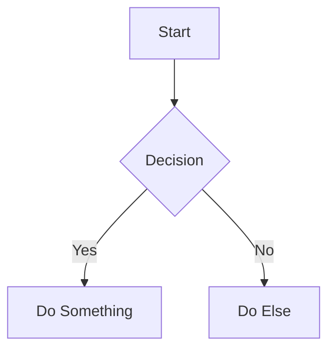

Boltdocs supports **Mermaid** diagrams. Diagrams can be written inside code blocks or directly using the `<Mermaid>` component.

---

## Installation

Diagram support requires `@bdocs/plugin-mermaid`. Register it in `boltdocs.config.ts`:

```ts
// boltdocs.config.ts
import { defineConfig } from 'boltdocs'
import mermaidPlugin from '@bdocs/plugin-mermaid'

export default defineConfig({
  plugins: [
    mermaidPlugin()
  ],
})
```

---

## Usage

### Markdown Code Blocks
Write standard `mermaid` code blocks:

````markdown

````

### Component Mode
Alternatively, use the `<Mermaid>` component:

```mdx
<Mermaid chart={`flowchart LR
  A --> B --> C
`} />
```

---

## Themes & Customization

You can define custom color variables for the diagram nodes and lines in `boltdocs.config.ts` for both light and dark modes:

```ts
mermaidPlugin({
  themes: {
    light: {
      primaryColor: '#e0f2fe',
      primaryTextColor: '#0c4a6e',
      primaryBorderColor: '#38bdf8',
      lineColor: '#64748b',
    },
    dark: {
      primaryColor: '#0c4a6e',
      primaryTextColor: '#e0f2fe',
      primaryBorderColor: '#38bdf8',
      lineColor: '#94a3b8',
    },
  },
})
```

### Supported Custom Variables

| Variable | Description |
| :--- | :--- |
| `primaryColor` | Background color of nodes |
| `primaryTextColor` | Text color within nodes |
| `primaryBorderColor` | Border color around nodes |
| `lineColor` | Connecting arrow/line color |
| `mainBkg` | Main canvas background |
| `nodeBorder` | Border style details |
| `edgeLabelBackground` | Background for labels on connection lines |
| `clusterBkg` | Group background color |
| `clusterBorder` | Group border color |
