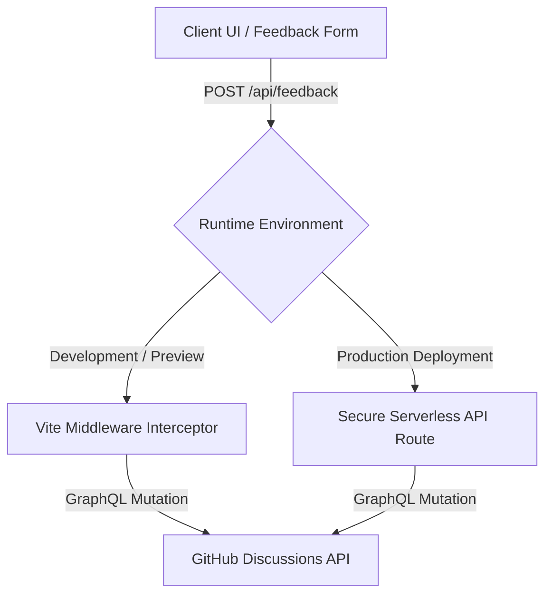

# Custom Feedback Integration

The **Custom Feedback** integration allows you to collect feedback ratings (😊, 😐, 🙁) and written suggestions from your readers directly into your **GitHub Discussions** thread registry without the overhead of heavy third-party iframe packages.

---

## Minimal Setup

To enable custom feedback, register your GitHub repository coordinates under the `integrations` section of your configuration file:

```ts title="boltdocs.config.ts"
import { defineConfig } from 'boltdocs'

export default defineConfig({
  integrations: {
    feedback: {
      custom: {
        enabled: true,
        owner: 'your-github-username-or-org',
        repo: 'your-repository-name',
        categorySlug: 'general', // Optional: defaults to 'general'
      },
    },
  },
})
```

---

## How It Works

Boltdocs splits the feedback submission pipeline into a local interceptor and a secure production API handler:



1. **Development & Preview:** When running `boltdocs dev` or `boltdocs preview`, a built-in server middleware automatically intercepts incoming POST requests to `/api/feedback`, signs a secure GitHub token or JWT, and sends the payload directly to GitHub's GraphQL API.
2. **Production Hosting:** When deployed to a static site host (like Vercel, Netlify, or Cloudflare Pages), there is no running Vite server to handle POST requests. You must deploy a serverless function endpoint to receive feedback securely.

---

## Quick Scaffold via `create-boltdocs`

When initializing a new Boltdocs project with the `create-boltdocs` CLI tool, the wizard prompts you to choose a deployment target. This can also be passed via the `--deploy` (or `-d`) CLI flag:

```bash
# Scaffold a new project configured for Cloudflare Pages
npm create boltdocs@latest my-docs-app -- --template base --deploy cloudflare
```

Depending on your selection, `create-boltdocs` automatically scaffolds the correct function folder and configuration:
- **Vercel**: Creates `api/feedback.ts`.
- **Netlify**: Creates `netlify/functions/feedback.ts` and redirects inside `netlify.toml`.
- **Cloudflare Pages**: Creates `functions/api/feedback.ts`.
- **AWS Lambda**: Creates `lambda/feedback.ts`.
- **Static Only**: Scaffolds a purely static build without setting up any serverless API functions.

---

## Production Deployment (Runtimes & Adapters)

To securely submit feedback in production without exposing your GitHub credentials to the browser, Boltdocs exports pre-built **runtime adapters** for major serverless providers.

### 1. Vercel Serverless Functions

To deploy on Vercel, create a file at `api/feedback.ts` at the root of your project:

```ts title="api/feedback.ts"
import { handleVercelFeedback } from 'boltdocs'

export default handleVercelFeedback
```

### 2. Cloudflare Workers / Vercel Edge

For Cloudflare Workers, Pages Functions, or Edge environments utilizing the web-standard `Request`/`Response` APIs:

```ts title="worker.ts or functions/api/feedback.ts"
import { handleWebFeedback } from 'boltdocs'

export default {
  async fetch(request: Request, env: any): Promise<Response> {
    const url = new URL(request.url)
    if (url.pathname === '/api/feedback') {
      return handleWebFeedback(request, env)
    }
    return new Response('Not Found', { status: 404 })
  }
}
```

### 3. Netlify Functions (AWS Lambda)

For AWS Lambda-style serverless handlers on Netlify:

```ts title="netlify/functions/feedback.ts"
import { handleNetlifyFeedback } from 'boltdocs'

export const handler = async (event: any) => {
  return handleNetlifyFeedback(event, process.env)
}
```

---

## Environment Variables Configuration

The production API handlers securely parse GitHub authentication keys from your host's environment variables. Ensure the following keys are set up in your hosting provider's dashboard:

| Variable | Description |
| :--- | :--- |
| **`BOLTDOCS_GITHUB_TOKEN`** | A personal access token (PAT) with `write` permission to repository discussions. |
| **`BOLTDOCS_GITHUB_REPO_OWNER`** | Override the GitHub repository owner/org name. |
| **`BOLTDOCS_GITHUB_REPO_NAME`** | Override the GitHub repository name. |

If you are using a **GitHub App** for authentication, define these variables instead:

| Variable | Description |
| :--- | :--- |
| **`GITHUB_APP_ID`** | The unique App ID generated by GitHub. |
| **`GITHUB_PRIVATE_KEY`** | The RSA private key of your GitHub App (newline-escaped). |
| **`GITHUB_INSTALLATION_ID`** | The installation ID for the target repository. |

---

## Visual Presentation

Once enabled, Boltdocs automatically injects premium, glassmorphic feedback forms at the bottom of standard documentation pages:

```md
Was this page helpful? [ Yes ]  [ Regular ]  [ No ]
```

And thumbs-up/down feedback elements directly next to the **Copy** action inside code block headers.

### Custom React Layouts (`useFeedback`)

If you want to construct your own custom feedback interface, import and utilize the lightweight `useFeedback` hook client-side:

```tsx
import { useFeedback } from 'boltdocs/client'

export function MyFeedbackComponent() {
  const { rating, setRating, comment, setComment, loading, submitted, submit, error } = useFeedback()

  if (submitted) {
    return <p>Thanks for your help!</p>
  }

  return (
    <div>
      <h4>Was this page useful?</h4>
      <button onClick={() => { setRating('good'); submit() }}>Yes</button>
      <button onClick={() => { setRating('bad'); submit() }}>No</button>
    </div>
  )
}
```
