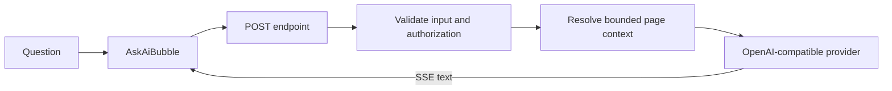

`@bdocs/plugin-ask-ai` adds a page-scoped documentation assistant. It can answer only from the documentation context selected for the request and returns `Not in docs.` when the answer is not grounded in that context.

<Callout variant="info" title="Page-scoped answers">
  This is documentation Q&A, not a general-purpose chatbot. Provider credentials and private prompts stay on the server; only explicitly public UI metadata is serialized to the browser.
</Callout>

## How it works



- The Vite middleware is mounted during `dev` and `preview`.
- The exported Web, Vercel, Netlify, and AWS adapters are available for serverless production deployments.
- Questions are checked against input limits and the injection denylist in every deployment path.
- Request bodies, context, and completion output are bounded before provider access.
- Upstream errors are reduced to safe public error codes; provider messages and credentials are not returned to the browser.

## Install

```bash
pnpm add @bdocs/plugin-ask-ai
```

```ts title="boltdocs.config.ts"
import askAiPlugin from '@bdocs/plugin-ask-ai'

export default {
  plugins: [
    askAiPlugin({
      title: 'Ask the docs',
      maxOutputTokens: 600,
      rateLimitPerMinute: 30,
    }),
  ],
}
```

Set the provider key in the environment, never in the config file:

```bash title=".env"
OPENAI_API_KEY=sk-...
```

The floating assistant is mounted through Boltdocs' `floating:after` plugin slot. Set `autoInject: false` when you want to place it yourself.

## Configuration

| Option | Default | Description |
| :--- | :--- | :--- |
| `provider` | `'openai'` | Provider preset. Each preset selects its own default model and environment-key name. |
| `model` | Provider default | Any model accepted by the selected OpenAI-compatible provider. |
| `baseURL` | Provider default | OpenAI-compatible base URL. Required for `anthropic`, `gemini`, `azure`, and `custom`. |
| `endpoint` | `'/api/ask-ai'` | Dev/preview POST endpoint. |
| `autoInject` | `true` | Mount `<AskAiBubble />` in the global floating slot. |
| `persona` | `undefined` | Optional identity and tone prepended to the default safety prompt. |
| `systemPrompt` | `undefined` | Full prompt override. Use only if you can preserve the page-scope and refusal rules. |
| `systemPrompts` | `undefined` | Per-provider full prompt overrides. |
| `maxInputChars` | `2_000` | Server-enforced question limit. |
| `maxRequestBytes` | `65_536` | Server-enforced request-body limit. |
| `maxOutputTokens` | `600` | Provider completion-token limit. |
| `contextChars` | `6_000` | Maximum page-context characters sent to the model. |
| `rateLimitPerMinute` | `30` | In-memory per-IP limit. Use `0` to disable. |
| `secretKey` | `undefined` | Minimum 16-character server-to-server bearer secret. Header-only; never placed in metadata. |
| `secretKeyEnv` | `undefined` | Environment-variable name from which to read the server secret. |
| `temperature` | `0.3` | Sampling temperature. |
| `topP` | `1` | Nucleus-sampling cutoff. |
| `devMode` | Auto outside production | Enables the token-usage chip. Keep disabled in production. |
| `title` | `'Ask Assistant'` | Header title. |
| `placeholder` | `'Ask about this page…'` | Composer placeholder. |
| `emptyTitle` | Default greeting | Empty-state title. |
| `emptyDescription` | Default description | Empty-state description. |
| `buttonTooltip` | `'Ask AI assistant'` | Launcher label and tooltip. |
| `composerHint` | Keyboard hint | Composer help text. |
| `classNames` | `{}` | Public Tailwind class-name slots. |

### Providers

The plugin always speaks the OpenAI Chat Completions wire format. Anthropic, Gemini, Azure, and custom providers must point to an OpenAI-compatible proxy.

```ts
askAiPlugin({
  provider: 'groq',
  model: 'llama-3.1-8b-instant',
  baseURL: 'https://api.groq.com/openai/v1',
})
```

```bash
GROQ_API_KEY=gsk_...
```

Provider-specific `OPENAI_BASE_URL` fallback is only used for the OpenAI provider. A Groq, Gemini, or Anthropic key cannot be redirected to an arbitrary OpenAI base URL.

## Customize the UI

Copy is configured in `boltdocs.config.ts`. Visual slots can be overridden in the same public config:

```ts
askAiPlugin({
  title: 'Docs Copilot',
  placeholder: 'Ask about this configuration…',
  classNames: {
    root: 'bottom-8 right-8',
    panel: 'w-[28rem] rounded-3xl border-primary-500/20',
    trigger: 'rounded-full size-14 shadow-primary-500/30',
    userMessage: 'bg-primary-600',
    assistantMessage: 'bg-soft border-primary-500/20',
  },
})
```

Available slots are `root`, `panel`, `trigger`, `header`, `messages`, `message`, `userMessage`, `assistantMessage`, `emptyState`, `composer`, `input`, and `markdown`. User classes win over plugin defaults through Tailwind merging.

For complete component replacement, disable automatic injection and compose the client components:

```tsx title="docs/layout.tsx"
import { AskAiBubble } from '@bdocs/plugin-ask-ai/client'

export function Assistant() {
  return <AskAiBubble endpoint="/custom/ask-ai" />
}
```

The client package also exports `AskAiDialog`, `ChatHeader`, `ChatInput`, `ChatMessage`, `ChatEmptyState`, `TypingIndicator`, `useAskAi`, and `MarkdownRenderer`.

### Open from another control

Use the global event instead of creating a second disconnected hook instance:

```tsx
export function HelpButton() {
  return (
    <button onClick={() => window.dispatchEvent(new CustomEvent('boltdocs:ask-ai:open'))}>
      Help
    </button>
  )
}
```

Supported events are `boltdocs:ask-ai:open`, `boltdocs:ask-ai:close`, and `boltdocs:ask-ai:toggle`.

## Serverless deployment

The dev/preview middleware cannot provide a serverless function automatically. Export one of the adapters from your platform's function entry and configure it only on the server.

```ts title="api/ask-ai.ts"
import { buildSystemPrompt } from '@bdocs/plugin-ask-ai'
import { handleWebAskAi } from '@bdocs/plugin-ask-ai/server'

export const config = {
  provider: 'openai',
  model: 'gpt-4o-mini',
  systemPrompt: buildSystemPrompt(),
  maxInputChars: 2_000,
  contextChars: 6_000,
  allowedOrigins: ['https://docs.example.com'],
}

export function POST(request: Request) {
  return handleWebAskAi(request, config)
}
```

CORS is same-origin by default. Set `allowedOrigins` only when a separate, trusted browser origin needs access.

Serverless deployments do not have the local Boltdocs filesystem. Pass a bounded context explicitly when the adapter permits it:

```tsx
<AskAiBubble
  getContext={() => ({
    page: window.location.pathname,
    content: document.querySelector('main')?.innerText.slice(0, 6_000) ?? '',
  })}
/>
```

Treat client context as untrusted input. For a public endpoint, prefer same-origin deployment, edge authentication, rate limiting, and a server-owned context source.

## Authentication and secrets

Provider keys are read only by the server handler and are not included in `metadata`, client props, SSE events, or public errors.

`secretKey` and `secretKeyEnv` protect direct server-to-server calls. Send the value only in `x-boltdocs-ask-ai-key`; URL query secrets are intentionally rejected because URLs leak through logs and diagnostics. Do not put a reusable secret in browser code.

For a normal public documentation assistant, omit `secretKey` and protect the endpoint with your hosting platform's user/session controls. The in-memory limiter is per process; use a shared edge limiter for multi-region deployments.

## `useAskAi`

| Return value | Description |
| :--- | :--- |
| `messages` | Current page-scoped messages and terminal status. |
| `input`, `setInput` | Controlled composer state. |
| `isLoading` | Whether a provider request is active. |
| `submitQuestion(text)` | Starts a request when one is not already active. |
| `stopStreaming()` | Aborts the active request while preserving visible partial text. |
| `clearChat()` | Aborts and clears messages. |
| `isOpen`, `setIsOpen` | Assistant visibility. |

Options are `endpoint`, `currentPage`, `context`, `getContext`, and `classNames`. The hook cancels its active request on unmount and does not log raw server errors.

## Security model

The package uses layered controls:

- bounded question, request-body, context, and output sizes;
- a deterministic denylist for common override attempts;
- escaped prompt delimiters for page and persona data;
- a page-scoped system prompt with a fixed `Not in docs.` refusal;
- authorization before request-body processing;
- per-IP rate limiting;
- same-origin CORS by default for adapters;
- public error codes that never echo upstream provider details.

Prompt-injection detection is not a mathematical guarantee. Keep the default system prompt and scope, authenticate public endpoints, and apply a shared production rate limit.

See [`SECURITY.md`](https://github.com/boltdocs/boltdocs/blob/main/packages/plugin-ask-ai/SECURITY.md) for the detailed deployment model.

## Troubleshooting

### `AI_NOT_CONFIGURED`

The selected provider key is missing on the server. Check the environment-variable name for the provider preset and the deployment's environment configuration.

### `UNAUTHORIZED`

A protected adapter received no valid `x-boltdocs-ask-ai-key` header. Never move the secret into a query string or browser bundle.

### `RATE_LIMITED`

The per-process limit was reached. Wait for `Retry-After` or add a shared edge limiter.

### The assistant says `Not in docs.`

The current page context does not contain enough information, the page exceeded `contextChars`, or a serverless adapter did not receive context. Check the request payload and adapter `allowClientContext` policy.

### Streaming stops

The visitor can stop generation, the request can disconnect, or the provider can hit the 60-second internal timeout. Partial assistant text remains visible after cancellation.
