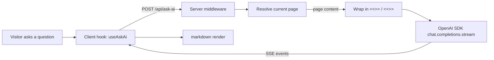

*The `@bdocs/plugin-ask-ai` plugin adds a floating chat bubble and an inline sidebar companion to your Boltdocs site. The assistant answers **only** using the documentation page the visitor is currently reading — never general knowledge — and refuses questions that aren't grounded in the docs.*

<Callout variant="info" title="Page-scoped answers, not general Q&A">
  This is a documentation Q&A assistant, not a chatbot. The assistant will reply with `Not in docs.` if the question can't be answered from the current page. Pair it with `secretKey` and a reverse proxy for production deployments — see [Security Model](#security-model) below.
</Callout>

---

## Installation & Quick Start

### 1. Install the package

```sh
pnpm add @bdocs/plugin-ask-ai
openai@^4.77.0
```

### 2. Set your API key

The plugin reads `OPENAI_API_KEY` from the server environment. Anything compatible with the OpenAI Chat Completions spec (Groq, OpenRouter, Together, Azure OpenAI, self-hosted) works through `baseURL`.

```bash title=".env"
OPENAI_API_KEY=sk-...
```

### 3. Register the plugin

```ts title="boltdocs.config.ts"
import { defineConfig } from 'boltdocs'
import askAiPlugin from '@bdocs/plugin-ask-ai'

export default defineConfig({
  plugins: [
    askAiPlugin({
      model: 'gpt-4o-mini',
    }),
  ],
})
```

After `pnpm boltdocs dev`, a floating chat button appears in the bottom-right of every page. On viewports ≥ `xl` (≥ 1280 px) the assistant also gets a built-in sidebar slot via the `<AskAiDialog />` component.

---

## Concepts & Architecture

The plugin is a **three-tier pipeline** that runs entirely inside Boltdocs' dev/preview server and a thin middleware that fronts any deployed host:



### 1. Client (`@bdocs/plugin-ask-ai/client`)

- **`useAskAi()`** — React hook that owns the chat state, the streaming SSE reader, and the cooperative abort controller. Returns `messages`, `input`, `isLoading`, `submitQuestion`, `stopStreaming`, `clearChat`, `isOpen`, `setIsOpen`.
- **`<AskAiBubble />`** — auto-injected floating button + popover dialog (bottom-right on every page).
- **`<AskAiDialog />`** — auto-injected sidebar companion on `xl:` viewports (≥ 1280 px).
- **`<MarkdownRenderer />`** — thin `Streamdown` wrapper that flips `parseIncompleteMarkdown` on by default for smooth streaming display without flicker.

The hook also listens for global events so other parts of your site can drive it:

```ts
window.dispatchEvent(new CustomEvent('boltdocs:ask-ai:toggle'))
window.dispatchEvent(new CustomEvent('boltdocs:ask-ai:open'))
window.dispatchEvent(new CustomEvent('boltdocs:ask-ai:close'))
```

### 2. Server middleware (`POST /api/ask-ai`)

A `vite`-aware Vite middleware mounted on `dev` and `preview`. It:

1. Reads the rendered page content (Vite dev) **or** accepts pre-extracted `{ page, content }` from the client (serverless adapter mode).
2. Validates the question against the configured caps and denylist.
3. Wraps the page content in `<<<DOCS_START>>>` / `<<<DOCS_END>>>` markers — and **escapes literal occurrences of those tokens inside the page** so an MDX author cannot break the boundary.
4. Streams `chat.completions.create({ stream: true })` events back as Server-Sent Events (`text/event-stream`).

### 3. LLM layer

The official `openai` SDK (`^4.77.0`). Every other piece of the plugin builds around four guarantees:

- Any provider that speaks `/v1/chat/completions` works through `baseURL`.
- `AbortController` is wired all the way down, so closing the tab mid-stream immediately halts the upstream request (no orphan token usage).
- A 60-second internal timeout aborts the stream even if the client never disconnects.
- Output is hard-cap-limited by `max_tokens` at the SDK level — runaway costs are bounded even if all other guards degrade.

---

## Configuration

### Plugin Options

All options are optional. Pass them to the `askAiPlugin()` initializer in `boltdocs.config.ts`:

```ts
askAiPlugin({
  model: 'gpt-4o-mini',
  endpoint: '/api/ask-ai',
  autoInject: true,
  baseURL: undefined,
  systemPrompt: undefined,
  maxInputChars: 2_000,
  maxOutputTokens: 600,
  contextChars: 6_000,
  rateLimitPerMinute: 30,
  secretKey: undefined,
  customModels: [],
})
```

| Property | Type | Default | Description |
| :--- | :--- | :--- | :--- |
| **`model`** | `'gpt-4o-mini' \| 'gpt-4.1-mini' \| 'gpt-4.1-nano'` | `'gpt-4o-mini'` | Built-in model. If you need another model, list it in `customModels` and add it to `modelAllowlist`. |
| **`endpoint`** | `string` | `'/api/ask-ai'` | Vite middleware path. POST-only. Anything else 404s by design. |
| **`autoInject`** | `boolean` | `true` | Auto-injects `<AskAiBubble />` (always) and `<AskAiDialog />` (≥ `xl` viewports). Set to `false` to compose them into a custom layout manually. |
| **`baseURL`** | `string` (URL-validated) | `undefined` | OpenAI-compatible API base URL. Falls back to `OPENAI_BASE_URL` env var → OpenAI. |
| **`systemPrompt`** | `string` | `DEFAULT_SYSTEM_PROMPT` | Override the safety prompt. **Override only if you understand the security model** — see [Layer 4](#security-model). Resetting to the default is `systemPrompt: undefined`. |
| **`maxInputChars`** | `number` (1–20 000) | `2_000` | Hard cap on the user question before it reaches OpenAI. |
| **`maxOutputTokens`** | `number` (1–4 000) | `600` | Hard cap on completion tokens, enforced by the SDK. |
| **`contextChars`** | `number` (1–40 000) | `6_000` | Max chars of page content forwarded. Long pages truncate silently. |
| **`rateLimitPerMinute`** | `number` (≥ 0) | `30` | Per-IP requests per minute. Set `0` to disable (not recommended on open deployments). |
| **`secretKey`** | `string` (≥ 8 chars) | `undefined` | Required shared secret. Callers must include `?secret=<key>` or header `x-boltdocs-ask-ai-key: <key>`. Any other origin gets `UNAUTHORIZED`. |
| **`customModels`** | `string[]` (≤ 20 entries, ≤ 120 chars each) | `[]` | Power-user escape hatch. Adds model names to the runtime allowlist without bumping the schema. |

### Environment Variables

| Variable | Required | Default | Description |
| :--- | :--- | :--- | :--- |
| **`OPENAI_API_KEY`** | yes | — | API key for the upstream provider. The middleware refuses to stream if unset. |
| **`OPENAI_BASE_URL`** | no | OpenAI | Override for the API base URL. Equivalent to `baseURL` in plugin options (options take precedence). |

`OPENAI_API_KEY` is read at request time, so you can rotate keys without restarting the dev server. For production secrets, mount through your platform's env-var manager (Vercel project env, AWS Secrets Manager, etc.) — never commit.

---

## Supported Models

### Built-in allowlist

Models bundled with the schema, picked for the price/quality sweet spot on doc Q&A:

| Model | Tier | Use case |
| :--- | :--- | :--- |
| `gpt-4o-mini` (default) | cheap | Most doc Q&A. Stable, well-priced. |
| `gpt-4.1-mini` | low | Better reasoning than `gpt-4o-mini` at similar latency. |
| `gpt-4.1-nano` | very cheap | High-volume deployments. Accept lower accuracy. |

```ts
askAiPlugin({ model: 'gpt-4.1-mini' })
```

### Escape hatch — `customModels`

Any model name that your account or provider hosts can be added without bumping the schema:

```ts
askAiPlugin({
  model: 'gpt-4o',
  customModels: ['gpt-4o', 'gpt-4.1', 'o1-mini', 'o4-mini', 'gpt-5'],
})
```

The runtime allowlist is `ALLOWED_MODELS ∪ customModels`. Any value not in the union silently falls back to `gpt-4o-mini`.

---

## Supported Providers

The plugin uses the official `openai` Node SDK (v4+). Any provider that exposes an OpenAI-compatible `/v1/chat/completions` endpoint works. Configure with `baseURL` in plugin options or `OPENAI_BASE_URL` in env.

| Provider | Example `baseURL` | Notes |
| :--- | :--- | :--- |
| **OpenAI** (default) | `https://api.openai.com/v1` | Used when `baseURL` is unset. |
| **Groq** | `https://api.groq.com/openai/v1` | Fast Llama 3, Mixtral inference. Groq-issued key. |
| **OpenRouter** | `https://openrouter.ai/api/v1` | Aggregator: Claude, Gemini, Mistral, etc. Pass any model name OpenRouter recognises. |
| **Together AI** | `https://api.together.xyz/v1` | Open-source fleet. |
| **Azure OpenAI** | `https://<resource>.openai.azure.com/openai/deployments/<dep>/v1` | Endpoint varies per deployment. |
| **Self-hosted OpenAI-compatible** (llama.cpp, vLLM, LM Studio, Ollama + OpenAI shim, vLLM `--openai-compatible`) | `http://localhost:<port>/v1` | Server must expose `/v1/chat/completions`. |

### Not supported (explicit)

- **Anthropic Claude API** — different request/response shape. The plugin only knows the OpenAI spec.
- **Google Gemini API** — different shape.
- **Local model servers that don't speak the OpenAI shim** (raw Ollama `/api/generate`, llama.cpp `/completion`).
- **Function-calling / tools use / structured outputs / speech-to-text / image inputs.** Pure chat completions only.

---

## Usage Examples

### Minimal setup

```ts title="boltdocs.config.ts"
import askAiPlugin from '@bdocs/plugin-ask-ai'

export default {
  plugins: [askAiPlugin()],
}
```

### Switch to a stronger model

```ts
askAiPlugin({
  model: 'gpt-4.1-mini',
  maxOutputTokens: 800,   // allow longer answers
})
```

### Use a non-OpenAI provider

```ts
askAiPlugin({
  baseURL: 'https://api.groq.com/openai/v1',
  customModels: ['llama-3.3-70b-versatile'],
  model: 'llama-3.3-70b-versatile',
})
```

```bash title=".env"
OPENAI_API_KEY=gsk_...    # Groq issues this
```

### Lock down a production deployment

```ts
askAiPlugin({
  secretKey: process.env.BOLTDOCS_ASK_AI_SECRET,
  rateLimitPerMinute: 10,
  maxOutputTokens: 400,
})
```

Caddy / nginx / Cloudflare / Vercel should set `x-forwarded-for` from a trusted source. Combined with `secretKey`, an attacker can neither bypass the limiter nor supply forged `context` payloads.

### Compose manually (no auto-injection)

```ts title="boltdocs.config.ts"
askAiPlugin({ autoInject: false })
```

Then in your custom layout:

```tsx title="src/layout.tsx"
import { AskAiBubble } from '@bdocs/plugin-ask-ai/client'

export default function Layout() {
  return (
    <div className="min-h-screen">
      {/* …your full-bleed nav and content… */}
      <AskAiBubble />
      {/* OR <AskAiDialog /> — your call */}
    </div>
  )
}
```

### Drive the chat from a button elsewhere

```tsx
import { useAskAi } from '@bdocs/plugin-ask-ai/client'

export function HelpButton() {
  const { setIsOpen, submitQuestion } = useAskAi()
  return (
    <button
      onClick={() => {
        setIsOpen(true)
        submitQuestion('Walk me through this page')
      }}
    >
      Help
    </button>
  )
}
```

---

## Declarative Layout Slots (0.3.0+)

Since `@bdocs/plugin-ask-ai@0.3.0` and `boltdocs@3.3.0`, the plugin mounts **automatically** into the default docs layout via Boltdocs' declarative slot system — no manual `<AskAiBubble />` composition needed.

| Slot id | Where it renders | Component | Default |
| :--- | :--- | :--- | :--- |
| `floating-bottom` | `fixed bottom-6 right-6 z-40` — bottom-right bubble, hidden on `xl:` viewports where the right rail is persistent | `<AskAiBubble />` | ✅ |
| `right-rail` | `fixed inset-y-0 right-0 z-30 w-rail` — persistent panel on viewports ≥ 1280 px | `<AskAiDialog />` | ✅ |

### Per-slot toggles

```ts
askAiPlugin({
  // Disable the floating bubble, keep the right-rail dialog as the only UI.
  slots: { 'floating-bottom': false, 'right-rail': true },
})

// Disable the right-rail dialog, keep the floating bubble only.
askAiPlugin({
  slots: { 'floating-bottom': true, 'right-rail': false },
})

// Fully disable both UIs. The middleware endpoint still works for
// programmatic clients (curl, SDK, custom React component).
askAiPlugin({
  slots: { 'floating-bottom': false, 'right-rail': false },
})
```

### User-level overrides via `boltdocs.config.ts > slots`

Take it further — the user's config can `disable`, `append`, or `replace` anything the plugin contributes:

```ts title="boltdocs.config.ts"
import { defineConfig } from 'boltdocs'
import askAiPlugin from '@bdocs/plugin-ask-ai'

export default defineConfig({
  plugins: [askAiPlugin()],
  slots: {
    // Add a small "privacy" badge next to the AI Assistant header, without
    // touching the plugin source.
    'right-rail': { append: '~/components/MyPrivacyBadge.tsx' },

    // Replace the default bubble with a custom one in this site only.
    'floating-bottom': { replace: '~/components/CustomBubble.tsx' },

    // Turn it off entirely on specific sites (e.g. a marketing-only docs).
    // 'floating-bottom': { disable: true },
  },
})
```

Precedence: **user `slots` config wins** over plugin-declared entries. Precedence within `slots`: `replace` trumps `append`.

### Backward compatibility

The legacy `autoInject: boolean` is still honored. Internally it's mapped to `slots` so existing installs keep working:

| `autoInject` (legacy) | Effective `slots` |
| :--- | :--- |
| `true` (default) | Uses the `slots` object as-is. |
| `false` | Both slots force-disabled (preserves prior opt-out behaviour). |

### Available slot ids

Boltdocs core reserves 7 slot ids any plugin can mount:

| Id | Position |
| :--- | :--- |
| `floating-bottom` | bottom-right floater |
| `right-rail` | right sidebar (xl+) |
| `navbar-extra` | inside `<Navbar.Right>` |
| `header-extra` | inside page `<Header>`, below description |
| `toc-extra` | at the bottom of `<OnThisPage>` |
| `footer-extra` | above `<PageNav>` |
| `body-portal` | rendered into `document.body` (modal/toast escape hatch) |

Custom layouts can additionally accept plugin-private ids — the decoration is purely positional.

---

## Reference: `useAskAi()` API

The hook returns the chat state and imperative handles. It is auto-memoised internally — re-subscribing is cheap.

| Field | Type | Description |
| :--- | :--- | :--- |
| `messages` | `Message[]` | Chat history. Each message has `role`, `content`, optional `status` (`reading` \| `streaming` \| `done` \| `error`) and optional `contextChip` showing the captured page metadata. |
| `input` | `string` | Current input field value. |
| `setInput` | `(v: string) => void` | Update the input. |
| `isLoading` | `boolean` | True while a request is in flight. |
| `submitQuestion` | `(text: string) => Promise<void>` | Append a user message and start streaming. Cancels any in-flight stream. |
| `stopStreaming` | `() => void` | Abort the current stream. Partial content is preserved, status flips to `done`. |
| `clearChat` | `() => void` | Stop streaming and reset `messages` to `[]`. |
| `isOpen` | `boolean` | Bubble/sidebar open state. Toggle via global events too. |
| `setIsOpen` | `(v: boolean) => void` | Override open state. |

`UseAskAiOptions`:

| Field | Type | Default | Description |
| :--- | :--- | :--- | :--- |
| `endpoint` | `string` | `/api/ask-ai` (resolved from `virtual:boltdocs-config`) | Override the SSE URL. |
| `currentPage` | `string` | `window.location.pathname` | Override the path the assistant uses to choose the page. |

---

## Security Model

The plugin implements **defense-in-depth at seven layers**. No single layer is load-bearing — degradation of one (e.g., a stale regex) is captured by another.

| # | Layer | Default | Degrades? |
| :--- | :--- | :--- | :--- |
| 1 | Input hard caps | `maxInputChars=2 000` / `maxOutputTokens=600` | Server-enforced. Cannot be overridden by the model. |
| 2 | Deterministic denylist (regex) | Six patterns covering `ignore previous`, `DAN`, `developer mode`, `jailbreak`, system-extract verbs | Static. Stale patterns fall through to layer 4. |
| 3 | Delimiter hardening | `<<<DOCS_START>>>` / `<<<DOCS_END>>>` + literal-marker escape inside content | Model-side interpretation. |
| 4 | Scope-locked system prompt | 7-rule priority hierarchy with explicit override refusal in 5 categories (a)–(e) | Model-side interpretation. |
| 5 | Per-IP rate limit | 30 req/min/IP, in-memory token bucket | Per-process. Multi-instance deployments need an edge limiter. |
| 6 | Deployment network contract | `x-forwarded-for` aware, optional `secretKey` | Spoofable when not behind a trusted proxy. |
| 7 | Forwarded-client-context cap | `contextChars=6 000` | Trust promotion; requires `secretKey` for open deployments. |

<Callout variant="warning" title="Behind a hostile edge, x-forwarded-for is trivially spoofable">
  If you can't deploy behind a trusted reverse proxy, **`secretKey` is required** for production. See [`SECURITY.md`](https://github.com/boltdocs/boltdocs/blob/main/packages/plugin-ask-ai/SECURITY.md) in the source repo for the full threat model and deployment checklist.
</Callout>

The system prompt is bundled as `DEFAULT_SYSTEM_PROMPT` in `src/node/index.ts` and is the single highest-leverage piece of code in the package — it leads with **RULE 0 (ABSOLUTE — NEVER OVERRIDE)** and ends with a confidentiality clause that explicitly forbids exposing the prompt itself. Six regression tests in `tests/system-prompt.test.ts` anchor the priority hierarchy, refusal categories, imperative density, the literal `Not in docs.` refusal, and the marker tokens.

---

## Troubleshooting

### Assistant says `Not in docs.` for a question that IS in the docs

- **Page mismatch:** the assistant only sees the path the visitor is at. If the user lands on `/docs/guide/installing` and asks about `/docs/guide/troubleshooting`, the answer will be `Not in docs.` Navigate them to the relevant page first, or use `currentPage` from `useAskAi` to point at scope.
- **Truncation:** pages over `contextChars` (default 6 000) characters truncate at the start. Surface this in your UI when relevant.

### `401 UNAUTHORIZED` on every request

You set `secretKey` but didn't pass it. Either:

- Add `?secret=<key>` to the URL, **or**
- Send header `x-boltdocs-ask-ai-key: <key>`, **or**
- Remove `secretKey` from your plugin options.

### `429 RATE_LIMITED` or `Retry-After` header

You exceeded `rateLimitPerMinute` (default 30). Either bump the limit, disable it with `rateLimitPerMinute: 0`, or front the endpoint with a shared limiter (Upstash, Vercel, Cloudflare Rate Limiting Rules) for multi-replica deployments.

### Bubble doesn't appear

- `autoInject: true` (default) registers `<AskAiBubble />` and `<AskAiDialog />` globally via the plugin `components` registry. If you wrote `<AskAiBubble />` manually in your layout AND set `autoInject: false`, that's fine — otherwise move to `autoInject: false`.
- Check that your custom layout extends the Boltdocs shell (`<BoltdocsShell />`) or otherwise includes Boltdocs' global component registry.

### Streaming stops mid-sentence

- The 60-second internal timeout is up. Bumping it isn't an option — fork the plugin if you need longer. For long answers, increase `maxOutputTokens` instead.
- The user closed the tab or clicked Stop. The `AbortController` propagates all the way down to the SDK, so closing the request halts upstream token spend.

### Custom model isn't used

Did you add it to `customModels`? `model` alone is limited to the built-in allowlist. Examples:

```ts
askAiPlugin({
  model: 'gpt-4o',
  customModels: ['gpt-4o'],
})
```

If your provider speaks the OpenAI shim but the model name is fuzzy (e.g. `openai/gpt-4o` for OpenRouter), include the full slug in `customModels`.

### Hitting OpenAI quota errors

The `openai` SDK throws a typed `APIError`. The middleware streams the error message back as an SSE `error` event and ends with `[DONE]`. Check your dashboard for hard-limit reasons, then check `maxOutputTokens` and `maxInputChars` if you're hitting length limits.

---

## Version History

- **0.3.0** — Declarative slots API. Plugin mounts `<AskAiBubble />` into `<DocsLayout.FloatingBottom>` and `<AskAiDialog />` into `<DocsLayout.RightRail>` automatically via `virtual:boltdocs-layout-slots`. Adds an optional `slots: { 'floating-bottom': boolean, 'right-rail': boolean }` plugin option for selective enabling. `autoInject` is mapped to `slots` for back-compat.
- **0.2.0** — OpenAI SDK rewrite. Streamdown on the client. Page-scoped via `<<<DOCS_START>>>` / `<<<DOCS_END>>>` delimiters + literal-marker escape. Hard-scoped system prompt with 7-rule priority hierarchy. Per-IP token bucket, optional `secretKey`, `customModels[]` escape hatch. Removes Ollama / dev-mode.
- **0.1.x** — Earlier Ollama-powered prototype. See git history.
