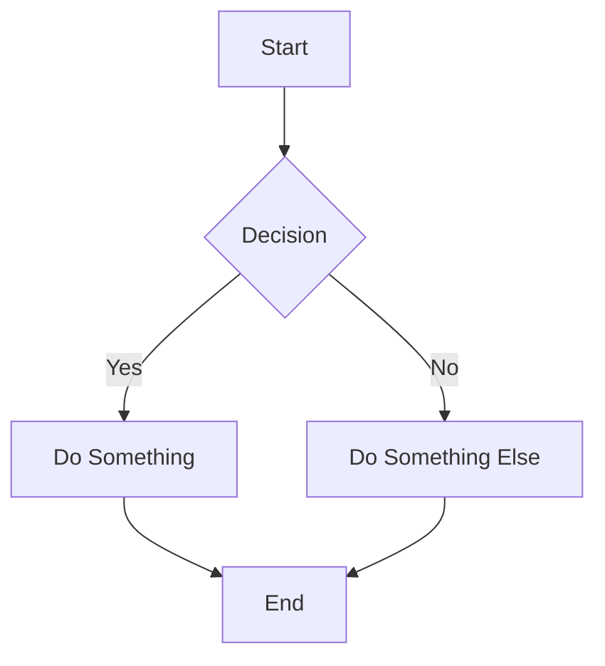
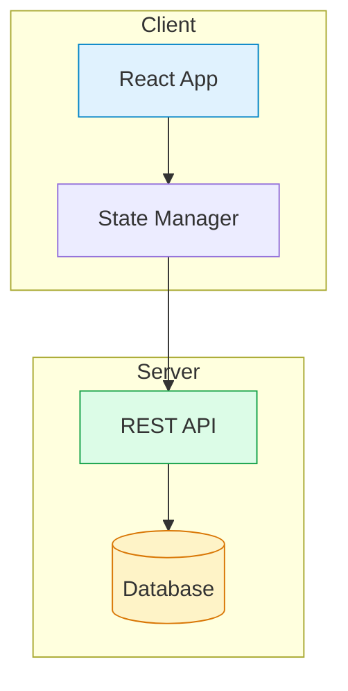

The `@bdocs/plugin-mermaid` plugin lets you render Mermaid diagrams in your MDX files. It automatically converts `mermaid` code blocks into interactive diagrams.

---

## Installation

```sh
pnpm add @bdocs/plugin-mermaid
```

---

## Configuration

Add the plugin to `boltdocs.config.ts`:

```ts
import { defineConfig } from 'boltdocs'
import mermaidPlugin from '@bdocs/plugin-mermaid'

export default defineConfig({
  plugins: [mermaidPlugin()],
})
```

---

## Custom Themes

You can customize the colors for light and dark themes by passing theme variables:

```ts
import { defineConfig } from 'boltdocs'
import mermaidPlugin from '@bdocs/plugin-mermaid'

export default defineConfig({
  plugins: [
    mermaidPlugin({
      themes: {
        light: {
          primaryColor: '#3b82f6',
          primaryTextColor: '#1e3a5f',
          primaryBorderColor: '#60a5fa',
          lineColor: '#64748b',
          mainBkg: '#ffffff',
          nodeTextColor: '#1e293b',
        },
        dark: {
          primaryColor: '#1e3a5f',
          primaryTextColor: '#93c5fd',
          primaryBorderColor: '#3b82f6',
          lineColor: '#94a3b8',
          mainBkg: '#0f172a',
          nodeTextColor: '#e2e8f0',
        },
      },
    }),
  ],
})
```

### Available Theme Variables

| Variable | Description |
| :--- | :--- |
| **`primaryColor`** | Background for primary nodes |
| **`primaryTextColor`** | Text color for primary nodes |
| **`primaryBorderColor`** | Border color for primary nodes |
| **`lineColor`** | Color for connecting lines |
| **`secondaryColor`** | Background for secondary elements |
| **`tertiaryColor`** | Background for tertiary elements |
| **`nodeBorder`** | Border color for nodes |
| **`mainBkg`** | Main background color |
| **`nodeTextColor`** | Default text color for nodes |
| **`edgeLabelBackground`** | Background for edge labels |
| **`clusterBkg`** | Background for cluster boxes |
| **`clusterBorder`** | Border for cluster boxes |

---

## Usage

### Code Block Syntax

Use a `mermaid` code block in any MDX file:

```mdx

```

The plugin automatically transforms this into a rendered `<Mermaid />` component.

### Component Syntax

You can also use the `<Mermaid>` component directly:

```mdx
<Mermaid chart={`flowchart LR
  A --> B
  B --> C
`} />
```

<Callout variant="info">
  Both approaches produce the same result. The code block syntax is preferred for readability in source files.
</Callout>

---

## Supported Diagram Types

Mermaid supports many diagram types:

| Type | Code Block Language | Example |
| :--- | :--- | :--- |
| **Flowchart** | `mermaid` | `flowchart TD; A --> B` |
| **Sequence Diagram** | `mermaid` | `sequenceDiagram; A->>B: Hello` |
| **Class Diagram** | `mermaid` | `classDiagram; class A` |
| **State Diagram** | `mermaid` | `stateDiagram-v2; A --> B` |
| **ER Diagram** | `mermaid` | `erDiagram; CUSTOMER \|\|--o{ ORDER` |
| **Gantt** | `mermaid` | `gantt; title Project` |
| **Pie Chart** | `mermaid` | `pie; "A": 40` |
| **Mindmap** | `mermaid` | `mindmap; root((Main))` |

---

## Theming

Mermaid automatically adapts to your site's light/dark theme. The plugin configures appropriate theme variables for each mode:

- **Light mode:** White backgrounds, dark text, subtle borders
- **Dark mode:** Dark slate backgrounds, light text, muted borders

The theme switches automatically when users toggle the site theme.

---

## Props

| Prop | Type | Required | Description |
| :--- | :--- | :--- | :--- |
| **`chart`** | `string` | ✓ | The Mermaid diagram definition string |

### Example with Props

```mdx
<Mermaid chart={`
  pie title Traffic Sources
    "Organic": 45
    "Direct": 30
    "Referral": 25
`} />
```

---

## Performance

Mermaid renders diagrams client-side. For large docs sites:

- Diagrams are rendered on first viewport entry
- Each diagram gets a unique DOM ID to prevent collisions
- The component shows a loading state while rendering

---

## Complete Example

````mdx
---
title: Architecture Guide
---

# System Architecture

Below is the high-level architecture of our application:


````

---

## Troubleshooting

### Diagrams not rendering

1. Verify the plugin is registered in `boltdocs.config.ts`
2. Check the code block language is exactly `mermaid`
3. Check browser console for syntax errors

### Theme doesn't match

The plugin automatically detects the Boltdocs theme. If using a custom layout, ensure you're using `useTheme()` from `boltdocs/client`.

### Large diagrams look cut off

Mermaid diagrams are scrollable. Add CSS to constrain or scale:

```css
.mermaid-container svg {
  max-width: 100%;
  height: auto;
}