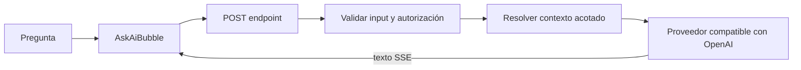

`@bdocs/plugin-ask-ai` añade un asistente de preguntas sobre documentación. Solo puede responder con el contexto seleccionado para la petición y devuelve `Not in docs.` cuando la respuesta no está fundamentada en ese contexto.

<Callout variant="info" title="Respuestas limitadas a la página">
  Esto es Q&A de documentación, no un chatbot general. Las credenciales del proveedor y los prompts privados permanecen en el servidor; solo se serializan al navegador los metadatos públicos de UI.
</Callout>

## Cómo funciona



- El middleware de Vite se monta durante `dev` y `preview`.
- Los adaptadores Web, Vercel, Netlify y AWS están disponibles para producción serverless.
- Las preguntas se validan con límites de input y una denylist de inyección en todos los despliegues.
- El body, el contexto y la salida se limitan antes de llamar al proveedor.
- Los errores upstream se convierten en códigos públicos seguros; los mensajes del proveedor y las credenciales no vuelven al navegador.

## Instalación

```bash
pnpm add @bdocs/plugin-ask-ai
```

```ts title="boltdocs.config.ts"
import askAiPlugin from '@bdocs/plugin-ask-ai'

export default {
  plugins: [
    askAiPlugin({
      title: 'Pregunta a los docs',
      maxOutputTokens: 600,
      rateLimitPerMinute: 30,
    }),
  ],
}
```

Configura la key del proveedor en el entorno, nunca en el config:

```bash title=".env"
OPENAI_API_KEY=sk-...
```

El asistente flotante se monta mediante el slot `floating:after` de Boltdocs. Usa `autoInject: false` si quieres colocarlo manualmente.

## Configuración

| Opción | Predeterminado | Descripción |
| :--- | :--- | :--- |
| `provider` | `'openai'` | Preset del proveedor. Cada preset selecciona su modelo y nombre de variable de entorno. |
| `model` | Default del proveedor | Cualquier modelo aceptado por el proveedor compatible con OpenAI. |
| `baseURL` | Default del proveedor | URL compatible con OpenAI. Obligatoria para `anthropic`, `gemini`, `azure` y `custom`. |
| `endpoint` | `'/api/ask-ai'` | Endpoint POST de dev/preview. |
| `autoInject` | `true` | Monta `<AskAiBubble />` en el slot flotante global. |
| `persona` | `undefined` | Identidad y tono opcionales antepuestos al prompt seguro. |
| `systemPrompt` | `undefined` | Override total del prompt. Úsalo solo si conservas el scope y los rechazos. |
| `systemPrompts` | `undefined` | Overrides de prompt por proveedor. |
| `maxInputChars` | `2_000` | Límite de pregunta aplicado en servidor. |
| `maxRequestBytes` | `65_536` | Límite de tamaño del body aplicado en servidor. |
| `maxOutputTokens` | `600` | Límite de tokens de completion. |
| `contextChars` | `6_000` | Máximo de caracteres de página enviados al modelo. |
| `rateLimitPerMinute` | `30` | Límite en memoria por IP. Usa `0` para desactivarlo. |
| `secretKey` | `undefined` | Secreto servidor-a-servidor de mínimo 16 caracteres. Solo por header; nunca se incluye en metadata. |
| `secretKeyEnv` | `undefined` | Nombre de la variable de entorno que contiene el secreto del servidor. |
| `temperature` | `0.3` | Temperatura de sampling. |
| `topP` | `1` | Corte de nucleus sampling. |
| `devMode` | Activo fuera de producción | Muestra el chip de consumo de tokens. Desactívalo en producción. |
| `title` | `'Ask Assistant'` | Título del header. |
| `placeholder` | `'Ask about this page…'` | Placeholder del compositor. |
| `emptyTitle` | Saludo default | Título del estado vacío. |
| `emptyDescription` | Descripción default | Descripción del estado vacío. |
| `buttonTooltip` | `'Ask AI assistant'` | Label y tooltip del launcher. |
| `composerHint` | Hint de teclado | Ayuda bajo el input. |
| `classNames` | `{}` | Slots públicos de clases Tailwind. |

### Proveedores

El plugin siempre usa el formato OpenAI Chat Completions. Anthropic, Gemini, Azure y `custom` deben apuntar a un proxy compatible con OpenAI.

```ts
askAiPlugin({
  provider: 'groq',
  model: 'llama-3.1-8b-instant',
  baseURL: 'https://api.groq.com/openai/v1',
})
```

```bash
GROQ_API_KEY=gsk_...
```

El fallback `OPENAI_BASE_URL` específico del provider solo se usa para OpenAI. Una key de Groq, Gemini o Anthropic no puede redirigirse a una URL arbitraria de OpenAI.

## Personalizar la UI

Los textos se configuran en `boltdocs.config.ts`. Los slots visuales también son públicos:

```ts
askAiPlugin({
  title: 'Docs Copilot',
  placeholder: 'Pregunta sobre esta configuración…',
  classNames: {
    root: 'bottom-8 right-8',
    panel: 'w-[28rem] rounded-3xl border-primary-500/20',
    trigger: 'rounded-full size-14 shadow-primary-500/30',
    userMessage: 'bg-primary-600',
    assistantMessage: 'bg-soft border-primary-500/20',
  },
})
```

Los slots disponibles son `root`, `panel`, `trigger`, `header`, `messages`, `message`, `userMessage`, `assistantMessage`, `emptyState`, `composer`, `input` y `markdown`. Las clases del usuario ganan sobre los defaults mediante Tailwind merge.

Para reemplazar componentes completos, desactiva la inyección y componlos manualmente:

```tsx title="docs/layout.tsx"
import { AskAiBubble } from '@bdocs/plugin-ask-ai/client'

export function Assistant() {
  return <AskAiBubble endpoint="/custom/ask-ai" />
}
```

El paquete cliente también exporta `AskAiDialog`, `ChatHeader`, `ChatInput`, `ChatMessage`, `ChatEmptyState`, `TypingIndicator`, `useAskAi` y `MarkdownRenderer`.

### Abrir desde otro control

Usa el evento global; una segunda instancia del hook tiene estado desconectado:

```tsx
export function HelpButton() {
  return (
    <button onClick={() => window.dispatchEvent(new CustomEvent('boltdocs:ask-ai:open'))}>
      Ayuda
    </button>
  )
}
```

Los eventos disponibles son `boltdocs:ask-ai:open`, `boltdocs:ask-ai:close` y `boltdocs:ask-ai:toggle`.

## Deployment serverless

El middleware dev/preview no genera automáticamente una función de producción. Exporta uno de los adaptadores desde la función de tu plataforma y configúralo solo en servidor.

```ts title="api/ask-ai.ts"
import { buildSystemPrompt } from '@bdocs/plugin-ask-ai'
import { handleWebAskAi } from '@bdocs/plugin-ask-ai/server'

export const config = {
  provider: 'openai',
  model: 'gpt-4o-mini',
  systemPrompt: buildSystemPrompt(),
  maxInputChars: 2_000,
  contextChars: 6_000,
  allowedOrigins: ['https://docs.example.com'],
}

export function POST(request: Request) {
  return handleWebAskAi(request, config)
}
```

CORS es same-origin por defecto. Configura `allowedOrigins` solo cuando otro origen confiable necesite acceso.

Los adapters serverless no tienen el filesystem local de Boltdocs. Pasa contexto acotado cuando la política del adapter lo permita:

```tsx
<AskAiBubble
  getContext={() => ({
    page: window.location.pathname,
    content: document.querySelector('main')?.innerText.slice(0, 6_000) ?? '',
  })}
/>
```

Trata el contexto del cliente como input no confiable. Para un endpoint público prefiere same-origin, autenticación en edge, rate limiting y una fuente de contexto propiedad del servidor.

## Autenticación y secretos

Las keys del proveedor las lee únicamente el handler del servidor. No aparecen en `metadata`, props del cliente, eventos SSE ni errores públicos.

`secretKey` y `secretKeyEnv` protegen llamadas directas servidor-a-servidor. Envía el valor solo mediante `x-boltdocs-ask-ai-key`; los query secrets se rechazan porque URLs se filtran en logs y diagnósticos. Nunca pongas un secreto reutilizable en código del navegador.

Para un asistente público normal, omite `secretKey` y protege el endpoint con los controles de usuario/sesión de tu plataforma. El limiter en memoria es por proceso; usa uno compartido en edge para despliegues multi-región.

## `useAskAi`

| Valor | Descripción |
| :--- | :--- |
| `messages` | Mensajes del scope actual y estado terminal. |
| `input`, `setInput` | Estado controlado del compositor. |
| `isLoading` | Si existe una petición al proveedor. |
| `submitQuestion(text)` | Inicia una petición cuando no hay otra activa. |
| `stopStreaming()` | Aborta la petición y conserva el texto parcial visible. |
| `clearChat()` | Aborta y limpia los mensajes. |
| `isOpen`, `setIsOpen` | Visibilidad del asistente. |

Las opciones son `endpoint`, `currentPage`, `context`, `getContext` y `classNames`. El hook cancela la petición activa al desmontarse y no registra errores crudos del servidor.

## Modelo de seguridad

El paquete combina:

- límites de pregunta, body, contexto y output;
- denylist determinista para intentos habituales de override;
- delimitadores escapados para datos de página y persona;
- prompt limitado a la página con rechazo fijo `Not in docs.`;
- autorización antes de procesar el body;
- rate limit por IP;
- CORS same-origin por defecto;
- errores públicos que nunca copian detalles del proveedor.

La detección de prompt injection no es una garantía matemática. Conserva el prompt y scope default, autentica endpoints públicos y usa un rate limit compartido en producción.

Consulta [`SECURITY.md`](https://github.com/boltdocs/boltdocs/blob/main/packages/plugin-ask-ai/SECURITY.md) para el modelo de deployment detallado.

## Troubleshooting

### `AI_NOT_CONFIGURED`

Falta la key del provider en el servidor. Revisa el nombre de variable del preset y el entorno del deployment.

### `UNAUTHORIZED`

Un adapter protegido no recibió un header `x-boltdocs-ask-ai-key` válido. Nunca muevas el secreto a la URL o al bundle del navegador.

### `RATE_LIMITED`

Se alcanzó el límite por proceso. Espera `Retry-After` o añade un limiter compartido en edge.

### El asistente responde `Not in docs.`

El contexto no contiene suficiente información, la página excede `contextChars` o el adapter serverless no recibió contexto. Revisa el body y `allowClientContext`.

### El streaming se detiene

El visitante puede detenerlo, la request puede desconectarse o el provider puede alcanzar el timeout interno de 60 segundos. El texto parcial permanece visible tras cancelar.
