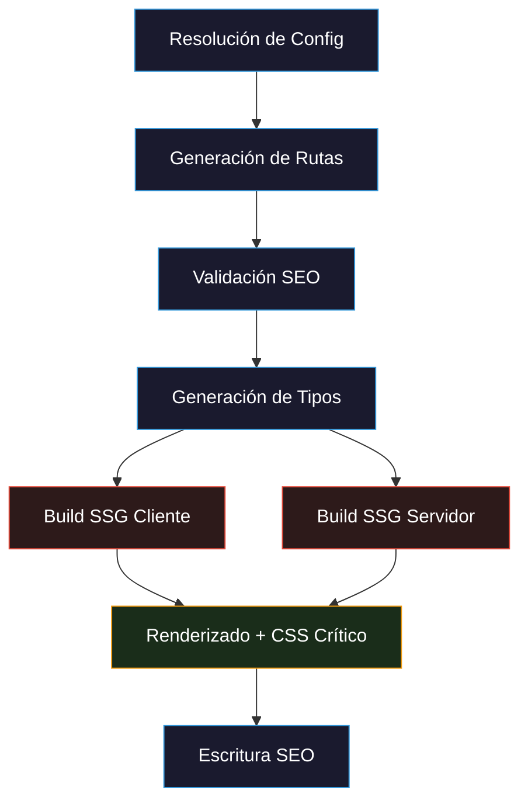
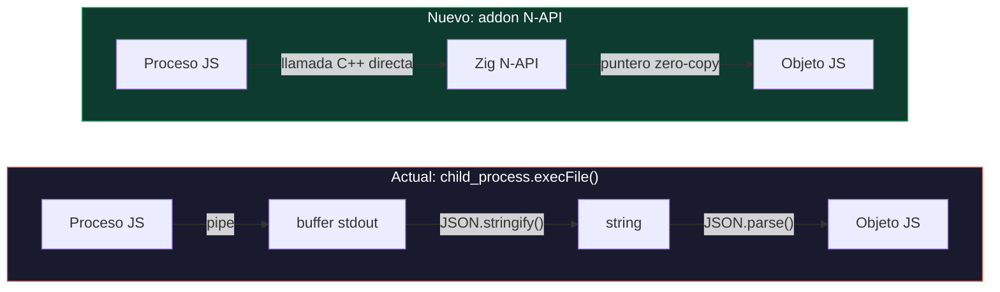
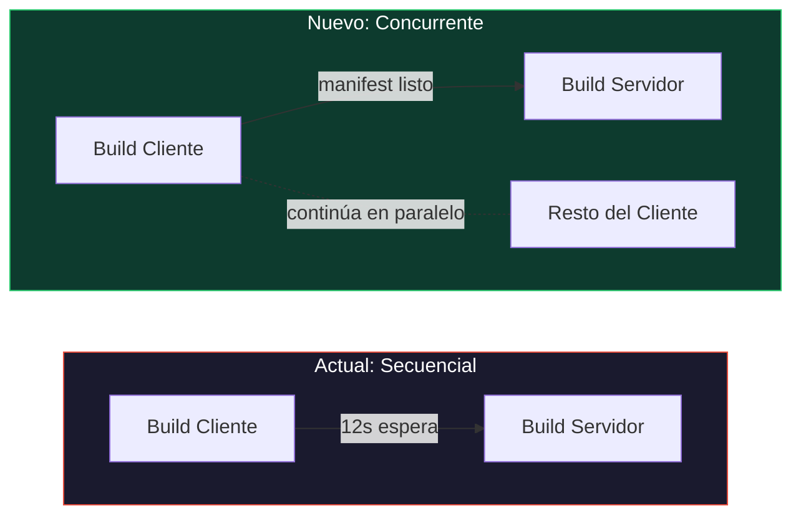
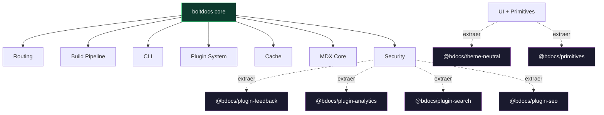

## Esta se trata del siguiente salto

3.0.0 trajo el parser nativo en Zig con aceleración 5-6x, la bandera experimental `--turbo` y `@bdocs/zig-critters` para CSS crítico. Eso fue el calentamiento.

<Callout type="info">
  El Proyecto Nitro es el roadmap de v4.0.0 — un plan de tres fases para lograr builds 4x más rápidos. Orquestación nativa, paralelismo con worker threads y caché inteligente por línea. Cada fase se envía al ~50% en los próximos releases menores.
</Callout>

La bandera `--turbo` que introduje en 3.0.0 fue el primer paso. La extracción de CSS crítico impulsada por Zig (`@bdocs/zig-critters`) procesa 300 archivos HTML en menos de un segundo. Eso probó el concepto: mover operaciones críticas del build a código nativo paga inmediatamente.

Ahora voy con todo.

---

## Dónde se va el tiempo hoy

Antes de hablar del 4x, así se ve un build de producción por dentro. Estos son benchmarks reales de un sitio de documentación con 200 páginas y ~600 bloques de código:



| Fase | Tiempo | % del total |
|------|--------|-------------|
| Resolución de config | ~50ms | 1% |
| Generación de rutas | ~500ms | 3% |
| Validación SEO | ~100ms | 1% |
| Generación de tipos | ~50ms | 1% |
| **Build SSG cliente** | **~12s** | **50-60%** |
| **Build SSG servidor** | **~8s** | **30-35%** |
| Render de páginas + CSS crítico | ~10s | — |
| Escritura SEO | ~50ms | 1% |

**El 80-90% del tiempo de build está en los dos builds de Vite.** Ahí es donde Nitro se enfoca.

---

## Las tres fases

### Fase 1 — Bajo esfuerzo, alto impacto (~2x)

Estas llegan primero. Son cambios aislados con retorno inmediato:

**Motor Shiki WASM oniguruma**

Hoy Shiki usa `createJavaScriptRegexEngine()` para el resaltado de código. Cambiar a `createOnigurumaEngine()` (basado en WASM) da 3-5x más velocidad sin cambiar ninguna API:

```
┌────────────────────┬──────────────┐
│ Motor              │ Tiempo       │
├────────────────────┼──────────────┤
│ JS regex (actual)  | 20ms/bloque  │
│ WASM oniguruma     | 5ms/bloque   │
└────────────────────┴──────────────┘
```

Para 600 bloques de código: **12s → ~3s**.

**Hash de cliente más inteligente**

`computeClientCodeHash()` escanea recursivamente todo el monorepo con `fs.statSync()` síncrono — miles de syscalls en cada build. Voy a cachear el hash y solo re-escanear cuando `packages/` realmente cambie.

**Paralelismo en el pipeline**

Actualmente el pipeline de 6 etapas corre completamente secuencial. Los pasos que no dependen entre sí (validación SEO + generación de tipos) correrán en paralelo.

**Sin gzip en modo dev**

`TransformCache` comprime con gzip cada shard al escribirlo — incluso en dev. Es CPU innecesaria en el hilo principal. Lo saltamos cuando `NODE_ENV !== 'production'`.

**Ganancia estimada: 2x inmediatamente.**

### Fase 2 — Esfuerzo medio, alto impacto

**FileStore shardeado**

El `DocCache` actual vuelca todos los archivos parseados en un solo JSON monolítico. Para 10,000 archivos son ~50MB cargados, parseados y guardados como un solo blob. Lo reemplazamos con shards content-addressables — O(1) por archivo en vez de O(n).

**Caché por ruta + parches delta**

Hoy, cambiar un archivo invalida TODOS los módulos virtuales (rutas, búsqueda, colecciones). La Fase 2 almacena rutas individualmente y envía parches delta al cliente. ¿Cambiaste un `sidebarPosition`? Eso es un parche de 200 bytes, no una recarga completa.

**HMR delta de frontmatter**

Editar frontmatter hoy dispara una recarga completa del navegador. Con actualizaciones delta, cambiar un `title` o `sidebarPosition` envía un parche JSON ligero. El store de rutas lo fusiona reactivamente — sin recarga, sin parpadeo.

**Worker threads para MDX**

Cada transformación MDX corre en el hilo principal. `ImageWorkerPool` de Boltdocs ya prueba que el paralelismo con worker threads funciona. Mismo patrón para MDX: 8 transformaciones en paralelo en un CPU de 8 núcleos.

```typescript
// Patrón ya probado por ImageWorkerPool
class MdxWorkerPool {
  private workers: Worker[]
  async transform(code: string, id: string) {
    // Enviar a worker disponible — no bloqueante
  }
}
```

**Mapa de dependencias de código cliente**

En vez de hashear cada archivo del proyecto, construimos un mapa de dependencias inverso desde el `ssr-manifest.json` de Vite. Rastreamos qué archivos fuente afectan a qué páginas renderizadas. ¿Un cambio CSS que solo toca 3 páginas? Solo re-renderizamos esas 3.

### Fase 3 — Alto esfuerzo, impacto muy alto

**Zig parser v2 — YAML + resolución de rutas**

Hoy el parser Zig extrae frontmatter y encabezados, pero el parseo YAML (`parseFrontmatterFast()`) y la resolución de rutas todavía corren en JavaScript. Son ~35 operaciones JS por archivo que deberían ser nativas. La Fase 3 las mueve todas a Zig.

**Addon nativo N-API**

Reemplazar `child_process.execFile()` con una llamada directa N-API. Sin serialización, sin I/O de filesystem, strings zero-copy de Zig a V8:



**Builds SSG concurrentes**

El build cliente de Vite y el build servidor de Vite corren secuencialmente. El build servidor necesita el manifest del cliente — pero no necesita que el build cliente *termine por completo*. Iniciamos el build servidor tan pronto como el manifest esté disponible:



**CSS crítico como post-procesamiento por lotes**

Hoy el CSS crítico bloquea cada render de página (concurrencia 1). Renderizamos todas las páginas primero, luego procesamos CSS crítico como un lote paralelo. Esto libera el paralelismo completo de renderizado.

**Páginas SSG content-addressables**

Si editas un archivo y deshaces la edición, el HTML renderizado es idéntico. Hoy se reescribe. La Fase 3 cachea por hash de contenido — salida idéntica significa cero I/O.

---

## Las matemáticas

**Línea base actual (200 páginas): ~35s total**

| Métrica | v3 (actual) | v4 (objetivo) | Aceleración |
|---------|------------|---------------|-------------|
| Build en frío | 35s | 9-12s | **~3-4x** |
| Editar 1 línea | 35s | 0.5-2s | **~20-70x** |
| CI (sin cambios) | 35s | 1-2s | **~20-35x** |
| Generación de rutas | 1.5s | 0.3s | **5x** |
| Resaltado de código | 12s | 3s | **4x** |
| Render de páginas | 10s | 4s | **2.5x** |

**El 4x es alcanzable en builds en frío. En builds incrementales, es un orden de magnitud más.**

---

## Cómo estoy construyendo esto

Cada fase se está desarrollando con ingeniería asistida por IA. El análisis del código base — identificar cada cuello de botella, trazar cada ruta de invalidación de caché, mapear cada dependencia — se hizo en colaboración con agentes de IA que exploraron todo el monorepo. La arquitectura misma se probó contra el código fuente real antes de escribir una sola línea de la Fase 1.

Los resultados hablan por sí mismos: el análisis identificó 12 cuellos de botella distintos, clasificados por impacto, con rutas de archivo y números de línea específicos. Ese es el nivel de precisión con el que estoy trabajando.

---

## Plan de entregas

Cada fase se envía aproximadamente al 50% en los próximos releases menores:

| Versión | Fase | Qué incluye |
|---------|------|-------------|
| 3.2.x | Fase 1 (50%) | Motor Shiki WASM, hash de cliente inteligente, paralelismo en pipeline |
| 3.3.x | Fase 1 (100%) + Fase 2 (50%) | FileStore shardeado, sin gzip en dev, prototipo de worker threads MDX |
| 3.4.x | Fase 2 (100%) | Caché por ruta, parches delta, HMR de frontmatter, mapa de dependencias |
| 3.5.x | Fase 3 (50%) | Zig parser v2, addon N-API, builds SSG concurrentes |
| **4.0.0** | **Fase 3 (100%)** | CSS crítico por lote, páginas content-addressables, Nitro completo |

La bandera `--turbo` que ya conoces desde 3.1.0 es la base. Cada fase la extiende.

---

## Más allá de la velocidad — un core más liviano

Nitro se trata de rendimiento de build. Pero hay otro cambio ocurriendo en paralelo: el core se está volviendo más liviano.

<Callout type="info">
El core se está desacoplando de integraciones, temas y componentes de UI — todo se mueve a plugins dedicados. La API de plugins también recibe una mejora mayor para dar a los plugins control total sobre providers, rutas y config del cliente. Esto se ejecuta en releases menores con un comando `boltdocs upgrade` para una migración sin problemas.
</Callout>

Integraciones como analytics, feedback, búsqueda Algolia y el tema neutral actualmente viven dentro de `boltdocs`. Eso significa que Vite los compila en cada build — incluso cuando no los usas. Moverlos a plugins significa que el core se mantiene pequeño y solo empaquetas lo que realmente necesitas:



La API de plugins misma está siendo rediseñada. Los plugins serán paquetes npm reales que exportan sus propios hooks y componentes React. Se acabó declarar paths de componentes en config — importas directamente del plugin. El core expone utilidades, contextos y un nuevo sistema de providers para que los plugins se integren limpiamente con el shell sin hacks.

El despliegue es gradual. Cada release menor migra una capa del core. Ejecuta `boltdocs upgrade` y todo se mueve automáticamente — sin cambios manuales de config.

---

## Lo que esto significa para ti

- **Sin breaking changes** en tu configuración, componentes o plugins en ninguna fase
- **`--turbo` se vuelve más rápido** con cada release menor
- **El dev server se mantiene instantáneo** — el HMR delta de la Fase 2 significa que editar frontmatter no recargará tu navegador
- **Los builds en CI pasan de minutos a segundos** cuando no hay cambios

Instala o actualiza:

```bash
pnpm add boltdocs@latest
```

Prueba la bandera `--turbo`:

```bash
pnpm boltdocs build --turbo
```

Revisa la [documentación completa](/docs/) para explorar todo lo nuevo.
