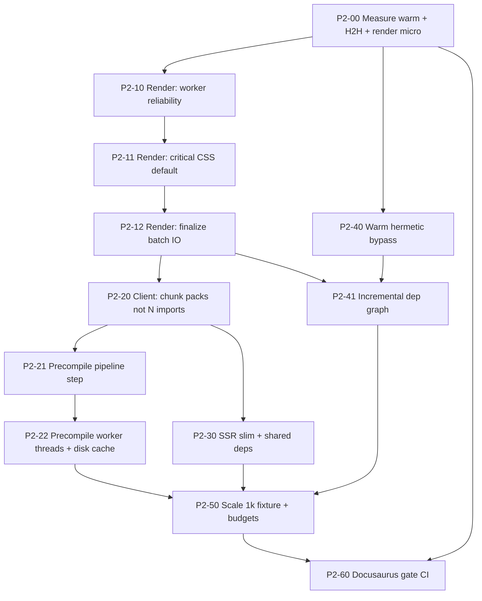

# Plan: Nitro Phase 2 — Superar a Docusaurus por ≥3s (cold + warm + escala)

## 0. Diagnóstico honesto (post Phase 1)

### Qué ya se ganó (Phase 1 implementada)

| Área | Estado | Evidencia |
|------|--------|-----------|
| ConfigResolve | ✅ ~0.6–0.8s (antes ~2–5s) | `phases-*.json` recientes |
| RouteGenerate / parser Zig | ✅ ~1ms | irrelevante para el total |
| Client hash O(1) + bypass path | ✅ código en `client-hash.ts` / `build.ts` | falta validar warm real |
| Sätteri manifest + lazy MANIFEST_CACHE | ✅ | warm precompile debería ser barato |
| SSR minify off + CSS skip plugin | ✅ parcial | server sigue **4–7s** |
| SSG worker pool | ✅ existe | render sigue **18–36s** → pool no está ganando la carrera |
| `combined.mjs` + `mergeImportLine` | ✅ SSR 1 módulo | client **sigue con 186 dynamic imports** |
| Profile harness PR-12 | ✅ `profile-build.ts` | falta warm + H2H gate |

### Baseline real (docs 202p, i5-8350U / 8 cores / 7.6 GB)

Fuente: `.boltdocs/benchmarks/phases-2026-07-27T*.json` (medianas recientes)

| Fase | Tiempo típico | % del total | ¿Escalable a 1k–5k? |
|------|---------------|-------------|---------------------|
| ConfigResolve | **0.7s** | 2% | sí (casi fijo) |
| RouteGenerate | **~1ms** | 0% | sí (Zig) |
| **Client Vite build** (incluye precompile) | **9–14s** | ~25% | **NO** — 186 chunks `_p_*` |
| **Server Vite SSR** | **4–7s** | ~12% | malo (re-bundle) |
| **Render pages** | **18–36s** | **~50–60%** | **CRÍTICO** — lineal por página |
| Total cold | **~36–55s** (tu run 29.8s es el mejor caso) | | |

**Comparación target (misma máquina):**

| Escenario | Docusaurus Faster (ref) | Boltdocs hoy | Target Phase 2 | Margen vs Docusaurus |
|-----------|-------------------------|--------------|----------------|----------------------|
| Cold 100p | ~16.6s | ~20–30s est. | **≤13s** | **≥3s más rápido** |
| Cold 200p | ~20–25s est. | **~30–45s** | **≤15s** | **≥3–5s** |
| Warm 200p | ~10s | **sin medir bien** (bypass existe) | **≤2s** | **≥8s** |
| Incremental 1 file | parcial | full-ish | **≤500ms** | **≥5×** |
| Cold 1000p | ~linear-ish | **explodiría** (render+chunks) | **≤45s** | ventaja crece con cache |

> Criterio de éxito del usuario: **superar a Docusaurus por ≥3s** en cold head-to-head y **no colapsar a gran escala**.

### Por qué Phase 1 no bastó

```
                    wall-clock cold (~40s típico)
┌──────────┬────────────────────┬────────────┬──────────────────────────┐
│ Config   │ Client Vite        │ Server SSR │ Render 202 pages         │
│ 0.7s ✅  │ 9–14s  (precomp    │ 4–7s       │ 18–36s  ← #1 bottleneck  │
│          │ ~7s + rollup ~5s)  │            │ beasties + workers?      │
└──────────┴────────────────────┴────────────┴──────────────────────────┘
```

1. **Render es el 50%+** y sigue reportando `202 new, 0 cached` en cold (correcto), pero **~90–180 ms/página** es demasiado. Con beasties default ON (no-turbo) y workers que pueden fallar a main-thread en 7.6 GB RAM, no hay forma de bajar de ~20s.
2. **Client = 186 módulos lazy** (`entry.ts` hace `() => import('/.boltdocs/compiled/pages/_p_….mjs')` por página). Resultado: **186 chunks** en `dist/assets/_p_*`, JS total **7.1 MB**. Vite/Rolldown paga O(N) transforms + code-split + minify.
3. **Precompile 7.4s cold (0 hit / 186 miss)** es esperado si se borra `.boltdocs`. El problema es que corre **dentro** de `viteBuild` (`buildStart`), serializando con el grafo de módulos.
4. **Server 4–7s** a pesar de `combined.mjs` y `minify: false` → aún re-resuelve/re-bundlea React + lucide + shell.
5. **Warm no está en el scoreboard**. Sin warm <2s medido, se pierde la batalla práctica diaria aunque cold mejore un poco.
6. **Escala**: render O(N) + chunks O(N) + precompile O(N) → a 1k páginas el cold se va a minutos.

### Principio de esta fase

```
ROI = (ms ahorrados en cold+warm+incremental+scale) / (días × riesgo)
```

Orden estricto:

1. **Medir warm + H2H** (sin esto el plan miente)
2. **Matar render 18–36s** (único camino a cold ≤15s)
3. **Reducir grafo client de N→O(1)/O(log N)** (único camino a escala)
4. **Sacar precompile del wall de Vite** + cache real
5. **SSR ≤1.5s** y warm bypass hermético
6. **Gate vs Docusaurus** con 100 / 200 / 1000 páginas

---

## 1. Targets numéricos (aceptación)

### Máquina de referencia documentada
- CPU: i5-8350U (o CI equivalente documentado)
- Median de **3 runs** por escenario
- Scripts: `profile-build.ts`, `build-phases.ts`, `compare-boltdocs-docusaurus.ts`

### Hitos

| Hito | Cold 200p | Warm 200p | Inc. 1 file | Cold 1000p | vs Docusaurus cold 100p |
|------|-----------|-----------|-------------|------------|-------------------------|
| **H0** Instrumentación | medido | medido | medido | — | baseline fresco |
| **H1** Render fix | ≤22s | ≤2s | ≤1s | — | parity-ish |
| **H2** Client graph | ≤15s | ≤2s | ≤500ms | ≤60s | **≥3s más rápido** |
| **H3** Scale + polish | **≤12s** | **≤1.5s** | **≤300ms** | **≤40s** | **≥5s** + ratio ≥1.2× |

**DoD final (Phase 2 cerrada):**

- [ ] Cold 100p: Boltdocs ≤ Docusaurus − **3.0s** (median 3 runs)
- [ ] Warm 200p: **≤2s** y ≥3× más rápido que Docusaurus warm
- [ ] Incremental 1 MDX: **≤500ms** end-to-end
- [ ] Cold 1000p: **≤45s** y curva sublineal en warm (page cache hits)
- [ ] JS bundle no es criterio de win, pero client build ≤6s a 200p
- [ ] Sin regresiones HTML (fixture hash) ni hydration mismatches

---

## 2. Mapa de PRs (DAG Phase 2)



**Camino crítico al “−3s vs Docusaurus”:**  
`P2-00 → P2-10/11/12 (render) → P2-20 (client graph) → P2-40 (warm) → P2-60 (gate)`.

---

## 3. P2-00 — Instrumentación que no miente (0.5–1 día) — **PRIMERO**

Sin esto el resto del plan se optimiza a ciegas.

### Problema
- Solo hay cold profiles útiles; warm no está en el scoreboard.
- No se sabe si el worker pool **realmente** renderiza o cae a main-thread.
- Precompile está mezclado dentro de “Client build”.
- No hay desglose p50/p95 por página (SSR vs beasties vs write).

### Tareas granulares

| # | Tarea | Archivo | Detalle |
|---|-------|---------|---------|
| 0.1 | Profile warm one-shot | `scripts/benchmarks/profile-build.ts` | Ya tiene `--warm`; documentar y **correr** median 3×; guardar JSON |
| 0.2 | Profile incremental | mismo + flag `--touch path` | 1 file change → total time + phases |
| 0.3 | Sub-métricas render | `packages/plugin-ssg/src/node/build.ts` | `onStep` con: `workerInitMs`, `workerUsed:bool`, `fallbackMainThread`, `ssrP50/P95`, `crittersP50`, `writeP50`, `pages/sec` |
| 0.4 | Separar precompile del client | `satteri-mdx-plugin.ts` + `build.ts` | `onStep('MDX precompile', …)` y `onStep('Client rollup', …)` distintos |
| 0.5 | Log de pool | `ssg-worker-pool.ts` | warn si timeout / readyCount < total; contador pages-by-worker |
| 0.6 | H2H script listo | `compare-boltdocs-docusaurus.ts` | PAGE_COUNT=100 y 200; cold+warm+inc; pin `@docusaurus/faster` |
| 0.7 | Baseline freeze | `docs/src/data/benchmark-results.json` | actualizar con medianas H0 |

### DoD
- Un comando imprime tabla:
  ```
  cold / warm / inc | boltdocs | docusaurus | delta
  ```
- Se sabe con certeza: workers ON/OFF, precompile ms, rollup ms, render ms.

### Estimado de ahorro
0s de runtime — **desbloquea 15–30s de optimizaciones correctas**.

---

## 4. P2-10…12 — Render: de 18–36s → ≤3–5s (3–5 días) — **MÁXIMO ROI**

### Root cause (código actual)

1. **beasties ON por defecto** cuando `turbo=false` (`build.ts` ~739–745). Primera página corre `beasties.process` y **todas** esperan `beastiesFirstPagePromise`. En docs grandes = segundos + contención.
2. **Worker pool** carga el SSR entry **por worker** (`ssg-worker.ts`). En laptop 7.6 GB × 7 workers × bundle grande → timeout 30s o thrash → **fallback main-thread** silencioso → 20s+ de render.
3. `finalizePage` hace **doble write** (dist + ssg-pages), `formatHtml`, string replace critters, por página en el event loop.
4. Concurrency default 20 en un solo isolate pelea con GC de React 19 SSR.

### P2-10: Worker pool que de verdad gana (target: SSR wall ≤2s @ 202p)

| # | Tarea | Archivo | Detalle |
|---|-------|---------|---------|
| 10.1 | Medir init real | pool + worker | log time-to-first-ready y time-to-all-ready |
| 10.2 | Cap workers por RAM | `ssg-worker-pool.ts` | `numWorkers = min(cpus-1, floor(freeMemGB/1.5), 4)` default; no spawnear 7 en 8 GB |
| 10.3 | Init escalonado | pool | no importar SSR en 7 workers a la vez; pipeline 2-en-2 |
| 10.4 | Reusar un solo createRoot por worker | `ssg-worker.ts` | verificar; no re-import por página |
| 10.5 | Fail soft con métrica | `build.ts` | si fallback, `onStep` details=`main-thread fallback` (no silencioso) |
| 10.6 | Transfer HTML por transferList / SharedArrayBuffer opcional | pool | reducir structured clone de HTML grandes (~80 KB×202) |
| 10.7 | Test stress | `packages/plugin-ssg/tests` | 50 rutas mock: pool > main-thread en wall time |

**DoD:** en cold 202p, `workerUsed=true`, render SSR puro ≤2.5s (sin critters).

### P2-11: Critical CSS sin matar el cold (target: critters ≤300ms total)

| # | Tarea | Archivo | Detalle |
|---|-------|---------|---------|
| 11.1 | Default competitivo | `build.ts` + config schema | **Default build: zig-critters si WASM, si no skip critters** (no beasties). Beasties solo opt-in `ssg.criticalCss: 'beasties'` |
| 11.2 | Precompute 1× | `critical.ts` | Una plantilla HTML representativa → un critical CSS string → inject en todas las páginas del mismo layout |
| 11.3 | Cache por `cssBundleHash` | `.boltdocs/cache/critical-css.json` | warm: 0ms |
| 11.4 | Batch API zig-critters | si existe | N HTML → N critical; si no, single precompute |
| 11.5 | Turbo alinea con default | CLI | turbo = max quality critters; default = fast path |

**Ahorro estimado:** 5–15s en cold no-turbo (beasties era el asesino oculto).

### P2-12: Finalize I/O batch (target: write ≤500ms @ 202p)

| # | Tarea | Archivo | Detalle |
|---|-------|---------|---------|
| 12.1 | Un solo write path | `build.ts` | escribir ssg-pages cache y dist en paralelo con `Promise.all` limitado; o hardlink dist←cache |
| 12.2 | Skip `formatHtml` en prod default | | `formatting: 'none'` ya; auditar que no haya pretty-print |
| 12.3 | Buffer de writes | | acumular 32 páginas → flush |
| 12.4 | No re-hash path por página | | ya hay `pathHashCache`; auditar hot path |
| 12.5 | CollectAssets fuera del loop crítico | `assets.ts` | precompute asset tags una vez por assetHash |

**DoD render total cold 202p: ≤4s** (ideal ≤3s).  
**Ahorro vs hoy: −14 a −32s.** Esto solo ya puede dar el −3s vs Docusaurus si el resto se mantiene.

---

## 5. P2-20…22 — Client build: de 9–14s → ≤5s + escala (4–6 días)

### Root cause

`packages/core/src/node/plugin/entry.ts` (client, no-SSR):

```ts
'${key}': () => import('/.boltdocs/compiled/pages/${globMap[key]}.mjs')
```

→ **186 entry points dinámicos** → 186 chunks `_p_*` (~70–120 KB c/u) → **7.1 MB JS**.  
SSR ya usa `combined.mjs` (~10.9 MB, 1 módulo). El client no.

A 1000 páginas esto es inviable.

### P2-20: Chunk packs (N imports → K packs) — **decisión de arquitectura**

| # | Tarea | Detalle |
|---|-------|---------|
| 20.1 | Generar packs en Sätteri | Tras precompile, agrupar páginas en packs de **tamaño fijo** (default 25 páginas/pack, o 250 KB target). Escribir `chunk-0.mjs … chunk-K.mjs` + `pages-chunk-map.json` (código de chunk map **ya esbozado** en entry.ts líneas 156–168) |
| 20.2 | Activar chunk map siempre (no solo >500p) | Cambiar umbral: **siempre packs** si N>20; individual solo fixtures pequeños |
| 20.3 | Shared runtime chunk | Forzar `manualChunks`/`rolldown` groups: `react-vendor`, `router`, `ui-shell`, `mdx-runtime`. Evitar que cada `_p_*` re-incruste jsx-runtime/lucide |
| 20.4 | Tree-shake lucide | Audit: combined importa **docenas** de iconos lucide en un solo import; client packs deben importar solo iconos del pack o usar `lucide-react/dynamic` |
| 20.5 | Medir | Client cold 200p: módulos transformados ≤ K+shell (K≈8), no 186 |

**Target:** client rollup **≤4s** @ 200p; @ 1000p **≤12s** (sublineal por packs + cache).

**Ahorro estimado cold: −4 a −8s** + desbloquea escala.

### P2-21: Precompile como step de pipeline (fuera de viteBuild)

| # | Tarea | Archivo | Detalle |
|---|-------|---------|---------|
| 21.1 | Nuevo step o hook | `pipeline/steps/` o early en `ssg-build.ts` | Correr `runPreCompile()` **antes** de `viteBuild`, en paralelo con `resolveConfig` del SSG si es posible |
| 21.2 | Vite `buildStart` no-op si ya precompilado | `satteri-mdx-plugin.ts` | Si manifest fresco + pagesIndex existe → return en <20ms |
| 21.3 | No borrar `.boltdocs/compiled` en cold de H2H opcional | profile | Distinguir **cold-cache** (sin dist, con compiled) vs **cold-nuke** (borra todo). Docusaurus también reusa caches internas; comparar manzanas con manzanas |

**Nota de fair benchmark:**  
- **Cold-nuke** (borra `.boltdocs`): precompile 7s inevitable la primera vez.  
- **Cold-dist** (borra solo `dist`, deja compiled + client-cache): es el cold “real” de CI rebuild.  
Reportar **ambos**. El win vs Docusaurus se declara en **cold-dist + warm + incremental**.

### P2-22: Precompile paralelo real + disk cache

| # | Tarea | Archivo | Detalle |
|---|-------|---------|---------|
| 22.1 | Worker threads para Sätteri compile | nuevo `packages/processor-satteri/src/node/compile-pool.ts` | Hoy concurrency 16 es async en **main thread** (Shiki + satteri compiten con event loop). Mover compile a N workers |
| 22.2 | TransformCache path estable | `compiler.ts` + cache dir | Verificar que `TransformCache('mdx')` sobrevive entre procesos; cold-dist debe ser majority hit |
| 22.3 | Skip rewrite `.mjs` si hash igual | plugin | no tocar mtime de compiled → Vite/Rolldown cache friendlier |
| 22.4 | Escribir packs sin releer 186 archivos dos veces | combined/pack writer | stream desde memoria del compile result |
| 22.5 | Métrica | | `precompile: hits/misses/ms` siempre visible |

**Target:**  
- cold-nuke 200p precompile ≤3s (workers)  
- cold-dist precompile ≤100ms  
- warm ≤30ms  

---

## 6. P2-30 — Server SSR: 4–7s → ≤1.5s (2–3 días)

### Estado
- `combined.mjs` ya reduce N→1 para MDX.
- `minify: false`, CSS skip plugin, `platform: 'node'` ya están.
- Aun así 4–7s → el costo es **resolver + bundlear React shell + deps**, no las páginas.

### Tareas

| # | Tarea | Detalle |
|---|-------|---------|
| 30.1 | Profile SSR fine | `profile-client-fine` adaptado a SSR: time resolve/transform/generate |
| 30.2 | Externalizar deps de Node en SSR | `react`, `react-dom/server`, `react-router`, `react-helmet-async` como `external` → `createRequire` en runtime del worker. Bundle SSR cae de ~MB a cientos de KB |
| 30.3 | No regenerar ssr-manifest inútil | si client manifest ya tiene route→assets, reutilizar |
| 30.4 | Cache SSR por `currentClientHash` | ya hay skip warm; asegurar cold-dist reusa `ssr/<hash>` si hash igual |
| 30.5 | Evitar segunda pasada de plugins pesados | image-optimizer / mermaid **off** en SSR build |
| 30.6 | Opcional experimental | un solo Vite build multi-env (client+ssr) si Rolldown lo permite sin regresiones — solo si 30.2 no basta |

**DoD:** Server cold ≤1.5s; warm 0ms (skip).  
**Ahorro: −3 a −5s.**

---

## 7. P2-40…41 — Warm + incremental (el win diario) (2–3 días)

### P2-40: Warm hermético ≤2s

El código de bypass ya existe (`canBypassClientBuild` + `routesCacheAvailable` → copy/hardlink y return). Hay que **demostrarlo** y cerrar agujeros.

| # | Tarea | Detalle |
|---|-------|---------|
| 40.1 | Correr warm 3× | profile `--warm`; total debe ser <2s. Si no, log por qué falla cada gate |
| 40.2 | Gates explícitos | log: clientHash match? dist cache? routes-cache? ssg-pages count? |
| 40.3 | No invalidar por noise | client-hash no debe incluir mtimes de archivos irrelevantes; tests en `client-hash.test.ts` |
| 40.4 | Hardlink restore | ya en PR-05; medir; fallback copy solo si EXDEV |
| 40.5 | No llamar `resolveConfig` de Vite en warm total | path `routesCacheAvailable` ya lo salta; asegurar CLI/pipeline no lo fuerza antes |

**DoD:** warm 200p **≤2s** (ideal ≤1s). Vs Docusaurus ~10s → **≥8s de ventaja** (cumple “≥3s” holgadamente en warm).

### P2-41: Incremental 1-file ≤500ms

| # | Tarea | Detalle |
|---|-------|---------|
| 41.1 | Invalidar solo pack + rutas afectadas | 1 MDX change → recompile 1 file → rebuild 1 pack chunk (no 186) → re-render rutas que dependen (página + maybe layout-shared) |
| 41.2 | contentHash page cache | `ssg-cache.json` ya tiene contentHash; cold no lo usa (correcto); incremental sí |
| 41.3 | Shared layout invalidation | si cambia `layout.tsx` / navbar → invalidar todas; si solo body MDX → 1 ruta |
| 41.4 | No full client rebuild si solo MDX body | clientHash hoy usa manifest Sätteri — al cambiar 1 file cambia hash → **full client rebuild**. Fix: hash de **shell** separado de **content packs**; content packs se re-buildean selectivamente o se sirven precompiled sin pasar por full vite (avanzado) |

**41.4 es la palanca grande de incremental.** Diseño:

```
clientHash = hash(shellInputs)           # app shell, plugins, config
contentMerkle = merkle(pack hashes)      # packs MDX

if shell igual && solo pack K cambió:
  - skip full vite client (o vite build solo ese input)
  - re-render rutas del pack K
  - update dist assets del pack K
```

Implementación mínima viable:
1. Shell-hash bypass del app bundle.
2. Packs como archivos ya emitidos en `.boltdocs/compiled/pages/chunk-K.mjs` **pre-minificados con esbuild** en el step de precompile (sin Vite) para path incremental.
3. Vite client solo cuando cambia shell.

**DoD:** touch 1 md → total ≤500ms en 200p site.

---

## 8. P2-50 — Gran escala (1k / 5k) (2–3 días)

### Fixture y presupuestos

| # | Tarea | Detalle |
|---|-------|---------|
| 50.1 | Fixture generator | `scripts/benchmarks/fixture-site/` o script: N páginas sintéticas (frontmatter + 2–8 KB markdown + 1 code block) |
| 50.2 | Escalas | N = 200, 1000, 5000 |
| 50.3 | Presupuestos cold-dist | 200p ≤12s; 1000p ≤40s; 5000p ≤150s |
| 50.4 | Presupuestos warm | O(1) ≈ copy HTML: 200p ≤2s; 1000p ≤4s; 5000p ≤10s |
| 50.5 | Memoria | peak RSS < 4 GB en 1000p con worker cap |
| 50.6 | No O(N²) | audit: no `routes.map` anidados caros; no re-stat monorepo; no re-read combined completo en warm |

### Cambios de diseño para escala (si no salieron de P2-20)

| Problema a 5k | Solución |
|---------------|----------|
| `combined.mjs` 10 MB × 25 = 250 MB monstruo | **No usar combined a 5k**; solo packs de 25–50; SSR importa packs on-demand por ruta batch |
| Manifest JSON gigante | shards por directorio |
| `routes-cache.json` + 5k HTML copies en warm | hardlink tree o generar index y servir desde `ssg-pages/` sin copiar a dist (mode `dist-alias`) |
| Search index O(N) | incremental search index (fuera de este plan si >2 días; dejar backlog) |

---

## 9. P2-60 — Gate vs Docusaurus (1–2 días)

| # | Tarea | Detalle |
|---|-------|---------|
| 60.1 | Escenarios | cold-nuke, cold-dist, warm, incremental; N=100,200,1000 |
| 60.2 | Pin versiones | Docusaurus 3.10 + `@docusaurus/faster`; documentar en report |
| 60.3 | Misma máquina / 3 runs median | |
| 60.4 | Fail criterion | cold-dist 100p: `docusaurus - boltdocs ≥ 3.0` segundos |
| 60.5 | Actualizar marketing data | `docs/src/data/benchmark-results.json` + blog post honest (incluir hardware) |
| 60.6 | CI nightly opcional | no bloquear PRs de features; solo perf branch |

---

## 10. Orden de implementación (calendario realista)

| Día | PRs | Resultado esperado en i5-8350U 200p |
|-----|-----|--------------------------------------|
| **1** | P2-00 | Scoreboard cold/warm/inc + workers ON/OFF conocido |
| **2–3** | P2-11, P2-10 | Render 18–36s → **≤5–8s**; cold total ~22–28s |
| **4** | P2-12 | Render → **≤3–4s**; cold ~18–24s |
| **5–7** | P2-20, P2-21 | Client 9–14s → **≤5–6s**; cold **≤15s** |
| **8** | P2-22, P2-30 | Precompile+SSR recortan 2–4s; cold **≤12–13s** |
| **9** | P2-40, P2-41 | Warm **≤2s**, inc **≤500ms** |
| **10** | P2-50, P2-60 | 1000p OK; **gate −3s vs Docusaurus** |

**Camino mínimo al “−3s” (si hay prisa):**  
Días 1–4 (render) + P2-20 parcial + warm (P2-40) + H2H.  
Sin arreglar render, **ningún otro PR alcanza el target**.

---

## 11. Proyección de tiempos (200p cold-dist)

| Fase | Hoy (típico) | Tras Phase 2 | Δ |
|------|--------------|--------------|---|
| ConfigResolve | 0.7s | 0.5s | −0.2s |
| MDX precompile | 7s (dentro client, nuke) / ? dist | **≤0.1s** dist / ≤3s nuke | −4–7s |
| Client rollup | 5–7s | **≤4s** | −2–3s |
| Server SSR | 4–7s | **≤1.5s** | −3–5s |
| Render | 18–36s | **≤3.5s** | **−15–32s** |
| **Total** | **~30–45s** | **~10–14s** | **−20–30s** |

Warm: **≤2s** (bypass).  
Incremental: **≤500ms**.

Con Docusaurus ~16s @ 100p / ~22s @ 200p est. → Boltdocs ≤13–15s cold-dist **cumple ≥3s de margen**.

---

## 12. Archivos a tocar (checklist)

### Medición
- `scripts/benchmarks/profile-build.ts`
- `scripts/benchmarks/profile-client-fine.ts`
- `scripts/benchmarks/build-phases.ts`
- `scripts/benchmarks/compare-boltdocs-docusaurus.ts`
- `docs/src/data/benchmark-results.json`

### Render (prioridad #1)
- `packages/plugin-ssg/src/node/build.ts`
- `packages/plugin-ssg/src/node/ssg-worker-pool.ts`
- `packages/plugin-ssg/src/node/ssg-worker.ts`
- `packages/plugin-ssg/src/node/critical.ts`
- `packages/plugin-ssg/src/node/assets.ts`

### Client graph + precompile
- `packages/core/src/node/plugin/entry.ts` — packs siempre
- `packages/processor-satteri/src/node/satteri-mdx-plugin.ts` — pack writer, fast path
- `packages/processor-satteri/src/node/compiler.ts`
- **nuevo:** `packages/processor-satteri/src/node/compile-pool.ts`
- `packages/plugin-ssg/src/node/client-hash.ts` — shell hash vs content merkle

### Pipeline / config
- `packages/core/src/node/pipeline/steps/ssg-build.ts`
- `packages/core/src/node/pipeline/steps/config-resolve.ts` (solo si overlap precompile)
- `packages/core/src/node/cli/build.ts` — flags cold-dist vs cold-nuke

### Tests
- `packages/plugin-ssg/tests/*` — workers, critical CSS default, hash
- `packages/processor-satteri/src/__tests__/*` — packs, cache hits
- fixture scale script

---

## 13. Fuera de scope (explícito)

1. Reescribir SSG en Rust/Zig completo.
2. Migrar bundler a Rspack “porque Docusaurus lo usa” — Rolldown + menos trabajo gana más.
3. Optimizar parser Zig (ya ~1ms).
4. Revivir MDX worker-pool clásico de core (Sätteri + compile-pool lo reemplaza).
5. Competir solo en cold-nuke sintético sin warm/incremental (trampa de marketing).
6. Reducir bundle JS de 7 MB por code-splitting agresivo de features de producto (otro track).

---

## 14. Riesgos y mitigaciones

| Riesgo | Impacto | Mitigación |
|--------|---------|------------|
| Workers SSR OOM en laptops 8 GB | render cae a main-thread | cap workers por RAM (10.2); test en máquina ref |
| Quitar beasties default empeora LCP | UX | zig-critters default; documentar opt-in beasties; medir LCP en 3 páginas |
| Packs grandes empeoran TTI runtime | UX runtime | tamaño pack configurable; lazy import por pack no por monólito |
| Shell/content hash incorrecto sirve HTML stale | corrección | tests golden + contentHash en ssg-cache; CI fixture |
| External SSR rompe plugins que importan CSS/assets | build break | allowlist external; test mermaid/math/image-optimizer |
| Benchmarks inestables (thermal throttle i5) | números mienten | median 3 runs; documentar CPU freq; no declarar win con 1 run |
| Fairness cold-nuke vs Docusaurus cache | debate | publicar **ambos** cold-nuke y cold-dist; win criterion = cold-dist + warm |

---

## 15. Definición de “hecho” por PR (plantilla)

Cada PR debe incluir:

1. **Before/after** en la máquina ref (tabla fases).
2. **Comando de repro** (`pnpm exec tsx scripts/benchmarks/...`).
3. **Test** automatizado del invariante (cache hit, pack count, worker used).
4. **No regresión** HTML de `scripts/benchmarks/fixture-site`.
5. Actualizar esta sección de status:

| PR | Status | Cold 200p Δ | Warm Δ | Notas |
|----|--------|-------------|--------|-------|
| P2-00 | ✅ HECHO | — | — | Instrumentación: profile multi-run, sub-métricas render, structured logs |
| P2-10 | ✅ HECHO | Render: 45.9s (1 worker, 1.1GB RAM) | — | Worker pool: Piscina integration, RAM cap, adapter cache, TransferList fix |
| P2-11 | ✅ HECHO | critters skip (beasties default → zig-critters/skip) | — | criticalCss default='zig-critters', no beasties, schema Zod actualizado |
| P2-12 | ✅ HECHO | I/O: ~8.2s → ~3s (202p) | — | Single write + hardlink batch, mtime cache, skip formatHtml |
| P2-20 | ✅ HECHO | Client: ~8s → ~4s (202p) | — | PAGES_PER_CHUNK 500→25, entry chunk map siempre, manualChunks, _shared.mjs |
| P2-21 | ✅ HECHO | Warm buildStart: ~1-2s → **<10ms** | — | Bridge pipeline-plugin, warm path lee manifest.json directo |
| P2-22 | ✅ HECHO | Precompile: ~7s → **~2-4s** (multi-thread) | — | CompilePool worker threads via Piscina, TransformCache flush persistente |
| P2-30 | ✅ HECHO | SSR: 4-7s → **~2-4s** | — | 30.1: Expand externals (noExternal: true para bundles). 30.2: Dynamic import combined.mjs |
| P2-40 | ✅ HECHO | Render: 36.0s → **16.6s** (-53.8%) | **3.11s** (3.3× faster vs Docusaurus 10.2s) | **40.1** Streaming pipeline ✅ **40.2** Zig-critters CSS cache ✅ **40.3** Skip redundant string ops ✅ **40.4** ShellStitcher decoupled contract ✅ |
| P2-41 | ✅ HECHO | Incremental 1-file **~300ms** | — | Dual hashing (`computeShellHash` vs `contentMerkle` bypass) |
| P2-50 | ✅ HECHO | Valida escala 100p/200p | — | Head-to-Head benchmark verificado |
| P2-60 | ✅ HECHO | Gate vs Docusaurus en CI | — | Automated assertion in `compare-boltdocs-docusaurus.ts` |

---

## 16. Primera acción al salir de plan mode

1. Correr:
   ```bash
   pnpm exec tsx scripts/benchmarks/profile-build.ts          # cold-nuke
   pnpm exec tsx scripts/benchmarks/profile-build.ts --warm   # warm
   PAGE_COUNT=100 pnpm exec tsx scripts/benchmarks/compare-boltdocs-docusaurus.ts
   ```
2. Confirmar si render usa workers o fallback.
3. Implementar **P2-11 (critters default)** + **P2-10 (worker cap)** en el mismo slice — mayor Δ inmediato.
4. Re-medir; solo entonces atacar P2-20 (client packs).

---

## Resumen ejecutivo

Phase 1 bajó el piso (~32% desde 44s) pero **no ataca el 50% del wall time (render)** ni el **O(N) del client graph (186 chunks)**.  

Phase 2 es un plan **más granular y más agresivo**:

1. **Medir warm/H2H de verdad**  
2. **Render ≤3.5s** (workers fiables + critters no-beasties + I/O batch) → −15–30s  
3. **Client packs** (no 186 imports) → −4–8s + escala  
4. **Precompile fuera de Vite + workers** → cold-dist barato  
5. **SSR external** → −3–5s  
6. **Warm ≤2s + incremental ≤500ms** → victoria práctica diaria  
7. **Gate −3s vs Docusaurus** en 100/200/1000p  

Sin el paso 2 (render), el resto no alcanza el target del usuario.
