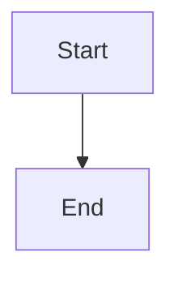

# Built-in MDX & Custom Components

Boltdocs supports a rich set of built-in components directly in MDX without requiring explicit import statements.

## Built-in Components

### Callouts (`<Callout>`)

Use callouts to highlight important guidelines, warnings, or tips.

```mdx
<Callout variant="tip" title="Pro Tip">
  Use `create-boltdocs` to scaffold your project instantly.
</Callout>
```

#### Variants
- `"info"` (Default blue)
- `"note"` (Muted neutral)
- `"tip"` (Green success)
- `"warning"` (Yellow attention)
- `"danger"` (Red alert)

---

### Grid Cards (`<Cards>` & `<Card>`)

Organize reference blocks into responsive multi-column layouts.

```mdx
import { Settings, BookOpen } from 'lucide-react'

<Cards cols={2}>
  <Card title="Configuration" href="/docs/guides/configuration" icon={<Settings />}>
    Set up theme, plugins, and custom configurations.
  </Card>
  <Card title="Guides" href="/docs/guides" icon={<BookOpen />}>
    Browse comprehensive user tutorials.
  </Card>
</Cards>
```

---

### Code Blocks & Mermaid Diagrams

#### Code Block Titles
Add titles to code blocks using the `title` attribute:
```ts title="docs/mdx-components.tsx"
// code goes here
```

#### Mermaid Diagrams
Standard `mermaid` code blocks are automatically parsed and rendered as interactive responsive diagrams:
````markdown

````

#### Math Equations
Wrap LaTeX formatting in single `$` (inline math) or double `$$` (block math) delimiters to automatically render equations via KaTeX:
```markdown
The quadratic formula is $-b \pm \sqrt{b^2 - 4ac} \over 2a$.
```

#### ⚠️ Critical Escape Rule for Code Block Backticks
When writing inline code that mentions triple backticks (e.g. to explain how to write a code block), **never** surround it with a single backtick like: `` ` ```mermaid ` ``. This conflicts with the MDX preprocessing parser, which will swallow closing tags (like `</Callout>`).
- Always escape inline code with four backticks:
  ```markdown
  Use ```` ```mermaid ```` code blocks to define diagrams.
  ```

---

## Global Custom Components (`mdx-components.tsx`)

To override HTML tags (e.g. custom `h2` classes) or expose your own React components globally in every MDX file, create a file named `mdx-components.tsx` in the root of your project:

```tsx title="mdx-components.tsx"
import type { ComponentType } from 'react'

const mdxComponents: Record<string, ComponentType<any>> = {
  // Override HTML h2 tag
  h2: ({ children, ...props }) => (
    <h2 className="text-2xl font-bold my-4 text-primary" {...props}>
      {children}
    </h2>
  ),
  
  // Register custom global component
  MyAlert: ({ type, children }) => (
    <div className={`alert alert-${type}`}>{children}</div>
  )
}

export default mdxComponents
```
