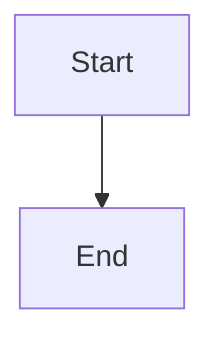

# Official Plugins

All official `@bdocs/*` plugins use the `createPlugin`/`definePlugin` API and are published on npm.

---

## `@bdocs/plugin-tailwindcss`

**Purpose**: Integrates Tailwind CSS v4 via `@tailwindcss/vite`.

```bash
pnpm add -D @bdocs/plugin-tailwindcss tailwindcss
```

```ts title="boltdocs.config.ts"
import tailwindcssPlugin from '@bdocs/plugin-tailwindcss'

export default defineConfig({
  plugins: [tailwindcssPlugin()],
})
```

Then use `@import "tailwindcss"` in your `index.css` and customize with `@theme` blocks.

---

## `@bdocs/plugin-sass`

**Purpose**: Provides SASS/SCSS preprocessing support via Vite's CSS preprocessor configuration.

```bash
pnpm add -D @bdocs/plugin-sass sass-embedded
```

```ts title="boltdocs.config.ts"
import sassPlugin from '@bdocs/plugin-sass'

export default defineConfig({
  plugins: [
    sassPlugin({
      additionalData: '@import "variables";',   // Injected into every SCSS file
      api: 'modern',                            // 'modern' | 'legacy'
      includePaths: ['./src/styles'],           // Additional import paths
    }),
  ],
})
```

---

## `@bdocs/plugin-unocss`

**Purpose**: Integrates UnoCSS atomic CSS engine via `@unocss/vite`.

```bash
pnpm add -D @bdocs/plugin-unocss unocss
```

```ts title="boltdocs.config.ts"
import unocssPlugin from '@bdocs/plugin-unocss'

export default defineConfig({
  plugins: [
    unocssPlugin({
      configFile: './uno.config.ts',
      mode: 'global',  // 'global' | 'per-module' | 'vue-scoped' | 'shadow-dom'
    }),
  ],
})
```

Create `uno.config.ts` with your presets.

---

## `@bdocs/plugin-mermaid`

**Purpose**: Automatically transforms standard `mermaid` code blocks into interactive, responsive diagrams that dynamically sync with light/dark theme preferences.

```bash
pnpm add @bdocs/plugin-mermaid
```

```ts title="boltdocs.config.ts"
import mermaidPlugin from '@bdocs/plugin-mermaid'

export default defineConfig({
  plugins: [
    mermaidPlugin({
      themes: {
        light: 'neutral',   // Mermaid theme for light mode
        dark: 'dark',       // Mermaid theme for dark mode
      },
    }),
  ],
})
```

Then use standard mermaid code blocks:

````markdown

````

---

## `@bdocs/plugin-math`

**Purpose**: Integrates KaTeX for rendering LaTeX math equations. Automatically transforms `$...$` (inline) and `$$...$$` (block) delimiters.

```bash
pnpm add @bdocs/plugin-math
```

```ts title="boltdocs.config.ts"
import mathPlugin from '@bdocs/plugin-math'

export default defineConfig({
  plugins: [mathPlugin()],
})
```

Usage in MDX:

```markdown
Inline: $E = mc^2$

Block:
$$ \sum_{i=1}^{n} i = \frac{n(n+1)}{2} $$
```

---

## `@bdocs/plugin-rss`

**Purpose**: Automatically generates RSS 2.0 and Atom feeds from your documentation routes. Supports i18n and collection filtering.

```bash
pnpm add @bdocs/plugin-rss
```

```ts title="boltdocs.config.ts"
import rssPlugin from '@bdocs/plugin-rss'

export default defineConfig({
  plugins: [rssPlugin()],
})
```

Feeds are generated at `dist/rss.xml` and `dist/atom.xml` during production builds.

---

## `@bdocs/plugin-llms-text`

**Purpose**: Generates an `llms.txt` file following the [llmstxt.org](https://llmstxt.org/) specification. Provides a standardized plain-text index of documentation optimized for Large Language Models and AI agents.

```bash
pnpm add @bdocs/plugin-llms-text
```

```ts title="boltdocs.config.ts"
import llmsTextPlugin from '@bdocs/plugin-llms-text'

export default defineConfig({
  plugins: [
    llmsTextPlugin({
      title: 'My Project',               // H1 heading (defaults to site title)
      description: 'Project docs',        // Blockquote summary
      bodyText: 'Additional LLM context', // Optional markdown body
      sortBy: 'sidebarPosition',          // 'path' | 'title' | 'sidebarPosition'
      maxLinksPerSection: 50,
      includeDrafts: false,
      devMode: false,                     // Generate in dev mode
      addLinkTag: true,                   // Add <link rel="llms-txt"> to HTML
      sections: [                         // Custom sections (optional)
        { title: 'Core', pathPrefix: '/docs/core', description: 'Core docs' },
        { title: 'Blog', pathPrefix: '/blog', description: 'Blog posts', optional: true },
      ],
    }),
  ],
})
```

Generated file: `dist/llms.txt`

---

## `@bdocs/plugin-image-optimizer`

**Purpose**: Optimizes images using Sharp and SVGO during the build process.

```bash
pnpm add @bdocs/plugin-image-optimizer
```

---

## `@bdocs/plugin-ask-ai`

**Purpose**: Provides a context-aware AI assistant querying interface for your documentation. Lets users ask questions about your docs.

```bash
pnpm add @bdocs/plugin-ask-ai
```

---

## `@bdocs/unist-utils`

**Purpose**: Strictly-typed AST utilities for unist/mdast/hast used by Boltdocs core and every official plugin. Exports visitors, AST builders, h-properties helpers, class-list mutation, and meta string parsing helpers.

Used as a dependency by core — available to plugins:

```ts
import { visit, builders, hProperties, classList, parseMeta } from '@bdocs/unist-utils'
```

---

## Plugin Compatibility

All plugins specify a `boltdocsVersion` field for version compatibility. The plugin validator checks this at load time:

```ts
// Plugin validation throws PluginCompatibilityError on mismatch
boltdocsVersion: '>=3.0.0'
```
